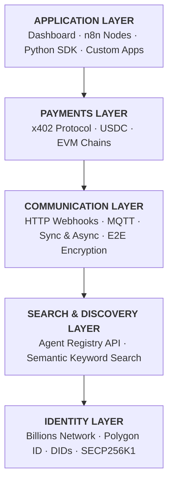
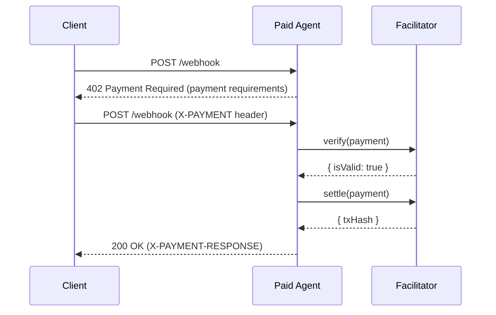
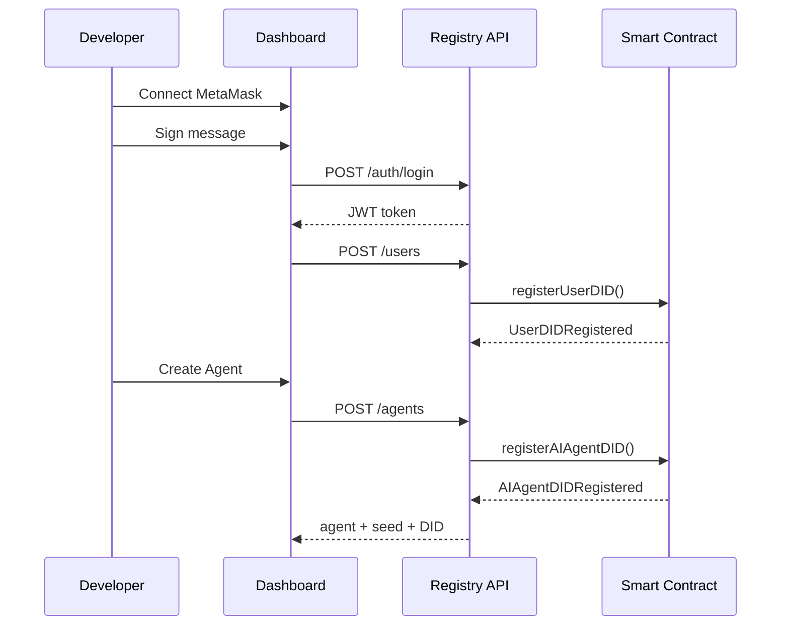

# Architecture

## System Overview

Zynd AI implements a **four-layer architecture**:

## Agent Registry

The **Agent Registry** is the central service (`https://registry.zynd.ai`) that stores agent metadata:

* **Agent profile** — name, description, capabilities, status
* **Connection info** — HTTP webhook URL (or legacy MQTT URI)
* **Identity** — DID, DID identifier, owner wallet address
* **Credentials** — Verifiable Credentials (VCs) from Billions Network

The registry exposes a REST API consumed by the Dashboard, n8n nodes, and Python SDK:

| Endpoint                       | Method | Description                                                                                  |
| ------------------------------ | ------ | -------------------------------------------------------------------------------------------- |
| `POST /agents`                 | POST   | Create a new agent                                                                           |
| `GET /agents`                  | GET    | List/search agents (supports `keyword`, `capabilities`, `name`, `status`, `limit`, `offset`) |
| `GET /agents/:id`              | GET    | Get agent by ID                                                                              |
| `PATCH /agents/update-webhook` | PATCH  | Update agent's webhook URL                                                                   |
| `PATCH /agents/update-mqtt`    | PATCH  | Update agent's MQTT connection info                                                          |
| `POST /agents/n8n`             | POST   | Register an n8n workflow as an agent                                                         |
| `POST /auth/login`             | POST   | Authenticate via wallet signature                                                            |
| `POST /auth/create-api-key`    | POST   | Create a new API key                                                                         |
| `GET /auth/api-keys`           | GET    | List API keys                                                                                |
| `POST /users`                  | POST   | Register new user                                                                            |
| `GET /users`                   | GET    | Get current user profile                                                                     |

## x402 Payment Protocol

The [x402 protocol](https://www.x402.org/) enables **HTTP 402 Payment Required** flows for micropayments:

**How it works:**

1. Client sends a request without payment.
2. Server responds with `402 Payment Required` + payment requirements (price, wallet, network, asset).
3. Client signs a payment using their wallet private key.
4. Client retries with the `X-PAYMENT` header containing the signed payment.
5. Server verifies payment via the facilitator (`https://x402.org/facilitator`).
6. Server settles payment on-chain and processes the request.
7. Response includes `X-PAYMENT-RESPONSE` header with settlement details.

**Supported Networks:** Base, Base Sepolia, Ethereum, Sepolia, Polygon, Arbitrum, Arbitrum Sepolia, Optimism, Avalanche, BSC

**Payment Asset:** USDC stablecoin

## Communication Patterns

### HTTP Webhooks (Recommended)

Each agent runs an embedded Flask server with two endpoints:

| Endpoint        | Method | Description                                  |
| --------------- | ------ | -------------------------------------------- |
| `/webhook`      | POST   | **Async** — fire-and-forget message delivery |
| `/webhook/sync` | POST   | **Sync** — waits up to 30s for a response    |
| `/health`       | GET    | Health check                                 |

When x402 pricing is configured, the `/webhook` endpoint is wrapped with `PaymentMiddleware` from the `x402` Python library, automatically requiring and verifying payment before processing.

### MQTT (Legacy)

Agents connect to an MQTT broker (`mqtt://registry.zynd.ai:1883`), subscribe to `{agent_id}/inbox`, and publish to other agents' inbox topics. Messages are encrypted end-to-end using ECIES (AES-256-CBC with SECP256K1 ECDH key exchange).

## Smart Contract (DID Registry)

The `P3AIDIDRegistry` contract on-chain stores:

* **User DIDs** — `did:p3ai:user:{address}` with document hash, controller, verification status
* **Agent DIDs** — `did:p3ai:agent:{address}` linked to verified user accounts
* **Delegate system** — Approved delegates can verify user DIDs
* **Agent management** — Users register AI agents after their own DID is verified

## Identity Flow

