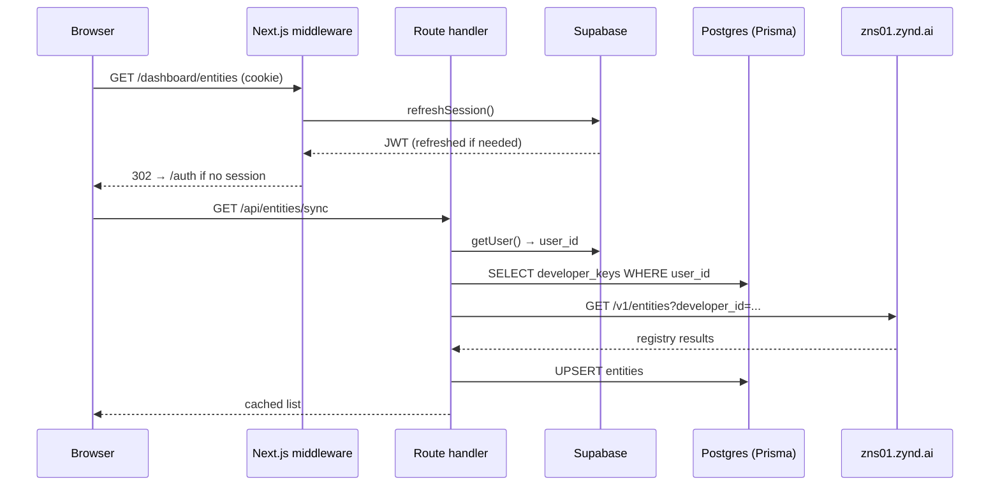

# Architecture

A signed-in dashboard request flows through three trust boundaries: the browser, the Next.js server (route handlers + middleware), and the upstream registry at `zns01.zynd.ai`. Each boundary has its own auth and data flow.

## Request lifecycle

## Three trust boundaries

| Boundary | Auth | Notes |
|----------|------|-------|
| Browser → Next.js server | Supabase JWT in HttpOnly cookie | Refreshed by `middleware.ts` on every request. |
| Next.js server → Postgres | Prisma + Supabase service role | Service role bypasses Postgres RLS — the route handler is the gatekeeper. |
| Next.js server → registry | Ed25519 signed payloads | Developer's private key is decrypted server-side from `developer_keys.private_key_enc` for each signed call. |

The browser **never** sees the developer's private key during normal operations. The download-key flow in `/dashboard/settings` is the only path that decrypts and streams the key out.

## Auth flow

`src/middleware.ts` runs on every request:

1. Reads the Supabase auth cookie.
2. Calls `supabase.auth.getUser()` — refreshes the access token if expired.
3. Writes the (possibly rotated) cookie back on the response.
4. For routes under `/dashboard/*`, redirects to `/auth` if no session.

`src/app/auth/callback/route.ts` is the OAuth landing page. It exchanges the OAuth code for a Supabase session, then:

1. Looks up `developer_keys` for the user_id.
2. If absent, redirects to `/onboard` to claim a handle and generate a key.
3. Otherwise, redirects to `/dashboard`.

`useAuth.ts` is the client-side hook that exposes `user`, `loading`, and `signOut` to the UI tree.

## Onboarding

`/onboard` is the first-run flow:

1. **Pick a handle** — typed in `/onboard/page.tsx`, debounced check via `GET /api/developer/username-check?username=...` (which proxies `GET /v1/handles/{handle}/available` on the registry).
2. **Submit** — `POST /api/developer/register` runs server-side:
   - Generates an Ed25519 keypair via `tweetnacl`.
   - Encrypts the private key with AES-256-GCM using `PKI_ENCRYPTION_KEY` (see [Data Model — Key encryption](/dashboard-app/data-model#key-encryption)).
   - Inserts a `developer_keys` row.
   - POSTs to the registry's onboarding webhook with `Authorization: Bearer ${AGENTDNS_WEBHOOK_SECRET}`.
3. Redirects to `/onboard/setup` for any additional setup (role, country), then `/dashboard`.

## Registry client

`src/lib/api/` wraps every `/v1/...` HTTP call to `zns01.zynd.ai`:

- **Public reads** (`/v1/search`, `/v1/categories`, `/v1/tags`, `/v1/network/...`) — no auth.
- **Signed writes** (`POST /v1/entities`, `PUT /v1/entities/{id}`, `DELETE /v1/entities/{id}`, `POST /v1/names`) — server-side: load encrypted private key, decrypt, sign canonical payload, send.
- **Webhook calls** (developer registration on restricted registries) — `Authorization: Bearer ${AGENTDNS_WEBHOOK_SECRET}`.

The base URL comes from `NEXT_PUBLIC_AGENTDNS_URL` for browser-readable reads and `AGENTDNS_REGISTRY_URL` for server-side writes (they're usually the same, but separating them lets you point reads at a CDN and writes at the canonical node).

## Data caching

The dashboard mirrors the user's own entities into local Postgres for two reasons:

1. **Speed** — `/dashboard/entities` lists from Prisma without round-tripping to the registry.
2. **Edit buffer** — drafts can be saved before pushing to the registry.

`/api/entities/sync` is the reconciliation point. It fetches `GET /v1/entities?developer_id=...` and upserts into `entities`. Called on `/dashboard/entities` mount and after every create / edit.

## Components

- `components/dashboard/sidebar.tsx`, `top-nav.tsx`, `credential-card.tsx` — authenticated layout chrome.
- `components/entities/entity-form.tsx` — the create / edit entity form. Used by both `/dashboard/entities/create` and `/dashboard/entities/[id]/edit`.
- `components/AgentDetailPage.tsx`, `RegistryPage.tsx` — public registry browser used at `/registry` and `/registry/[id]`.
- `components/ui/` — primitives (buttons, modals, tooltips).

## State

- **Server state** — Supabase session, Prisma rows, registry responses. Fetched per request.
- **Client state** — `store/global.store.ts` (Zustand) for cross-component UI state. `hooks/useEntities.tsx` for SWR-style entity caching.

## Background concerns

- **Marketing pages** (`/`, `/blogs/*`, `/privacy-policy`, `/terms-of-service`) — fully static, no auth checks. Pulled out of the auth middleware via path matchers.
- **Sitemap** — `src/app/sitemap.ts` generates a sitemap from blog posts and static routes for SEO.
- **Newsletter** — `POST /api/subscribe` writes to the `subscribers` table.

## Next

- **[API Routes](/dashboard-app/api-routes)** — every internal Next.js route handler.
- **[Data Model](/dashboard-app/data-model)** — Prisma schema and identity flow.
- **[Self-Host](/dashboard-app/self-host)** — env vars and deployment.
