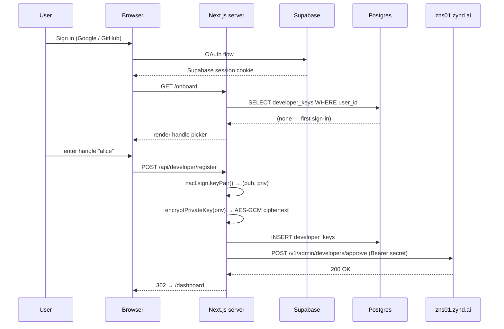

# Data Model

The dashboard owns three Postgres tables managed via Prisma:

| Table | What it holds |
|-------|---------------|
| `developer_keys` | One row per signed-in user. Maps Supabase `user_id` to a registered Zynd developer identity, including the **encrypted** private key. |
| `entities` | Local cache of the user's registered agents and services. Reconciled with `zns01.zynd.ai` via `/api/entities/sync`. |
| `subscribers` | Newsletter email captures from the marketing site. |

`prisma/schema.prisma` is the source of truth; migrations live in `prisma/migrations/`.

## `developer_keys`

```prisma
model DeveloperKey {
  id             String   @id @default(uuid()) @db.Uuid
  userId         String   @unique @map("user_id")
  developerId    String   @unique @map("developer_id")
  publicKey      String   @map("public_key")
  privateKeyEnc  String   @map("private_key_enc")
  name           String
  username       String?  @unique @map("username")     // ZNS handle
  role           String?  @map("role")
  registrationIp String?  @map("registration_ip")
  country        String?
  createdAt      DateTime @default(now()) @map("created_at") @db.Timestamptz(6)

  @@map("developer_keys")
}
```

- `userId` — Supabase `auth.users.id`. Unique → one Zynd identity per Supabase account.
- `developerId` — `zns:dev:<hex>` derived from `publicKey`.
- `publicKey` / `privateKeyEnc` — Ed25519 keypair. Public is base64; private is AES-256-GCM encrypted (see below).
- `username` — the ZNS handle. Unique across the dashboard's local DB; the upstream registry enforces uniqueness across the mesh.
- `role` — `"admin"` unlocks `/dashboard/admin` and `/api/admin/*`. Default null.
- `registrationIp` / `country` — captured at signup for rate limiting / abuse triage.

## `entities`

```prisma
model Entity {
  id              String   @id @default(uuid()) @db.Uuid
  userId          String   @map("user_id")
  entityId        String?  @unique @map("entity_id")     // zns:<hex> from registry
  name            String
  description     String?
  entityUrl       String?  @map("entity_url")
  category        String?
  tags            String[] @default([])
  summary         String?
  entityIndex     Int?     @map("entity_index")          // HD derivation index
  fqan            String?
  entityType      String?  @default("agent") @map("entity_type")
  serviceEndpoint String?  @map("service_endpoint")
  openapiUrl      String?  @map("openapi_url")
  entityPricing   Json?    @map("entity_pricing")
  status          String   @default("active")
  source          String   @default("dashboard")
  createdAt       DateTime @default(now())
  updatedAt       DateTime @default(now()) @updatedAt

  @@map("entities")
}
```

This is a **mirror** of registry state, not the source of truth. The flow is:

1. User submits the entity form.
2. Server signs `POST /v1/entities` on the registry → gets back `entity_id` and `fqan`.
3. `prisma.entity.create()` fills in the local cache.
4. `/api/entities/sync` keeps it aligned with the registry (handles drift if entities are edited via CLI or another dashboard instance).

Why mirror at all? The registry is paginated and federated; listing the user's own entities locally is faster and lets the dashboard show drafts before the registry sees them.

## `subscribers`

```prisma
model Subscriber {
  id        String   @id @default(uuid()) @db.Uuid
  email     String   @unique
  createdAt DateTime @default(now())

  @@map("subscribers")
}
```

Newsletter capture from `POST /api/subscribe`. No relation to anything else.

## Identity flow (end-to-end)



The user never sees the private key in the browser at any point during signup. The only time the plaintext key leaves the server is when the user explicitly clicks **Download keypair** in `/dashboard/settings`.

## Key encryption

`src/lib/pki.ts`:

```ts
const ALGORITHM = "aes-256-gcm";

function getMasterKey(): Buffer {
  const hex = process.env.PKI_ENCRYPTION_KEY;          // 64-char hex (32 bytes)
  if (!hex || hex.length !== 64) throw new Error(...);
  return Buffer.from(hex, "hex");
}

export function encryptPrivateKey(b64: string): string {
  const key = getMasterKey();
  const iv = crypto.randomBytes(12);
  const cipher = crypto.createCipheriv(ALGORITHM, key, iv);
  const encrypted = Buffer.concat([cipher.update(b64, "utf8"), cipher.final()]);
  const authTag = cipher.getAuthTag();
  return Buffer.concat([iv, authTag, encrypted]).toString("base64");   // iv | tag | ciphertext
}
```

- **Algorithm**: AES-256-GCM. Authenticated encryption — any tampering is detected.
- **Master key**: 32 bytes from `PKI_ENCRYPTION_KEY` env. Generate with `openssl rand -hex 32`.
- **IV**: 12 random bytes per encryption. Stored alongside the ciphertext, never reused.
- **Format on disk**: `base64(iv || authTag || ciphertext)` — single string in `private_key_enc`.

::: warning Rotating PKI_ENCRYPTION_KEY
The master key is symmetric and applies to every row in `developer_keys`. Rotating it is a multi-step migration: read every `private_key_enc`, decrypt with the old key, re-encrypt with the new key, write back, then flip the env var. There's no helper for this — write a one-off script and run it inside a transaction.
:::

## Postgres schema vs Supabase

The dashboard uses Postgres directly via Prisma — *not* Supabase's auto-generated REST API. Supabase is only there for Auth (JWTs, OAuth providers, the `auth.users` table).

This means:

- RLS isn't used on the dashboard's own tables (`developer_keys`, `entities`, `subscribers`). The Next.js route handlers are the only thing that talks to them, and they enforce auth manually via `getUser()`.
- The Prisma client uses `DATABASE_URL`, which can point at the same Postgres instance Supabase uses (with a different schema) or a totally separate one.

## Migrations

```bash
pnpm prisma migrate dev    # local: creates a new migration from schema.prisma diff
pnpm prisma migrate deploy # production: applies pending migrations
```

The `prisma/migrations/` folder is checked in. Don't edit applied migrations — make a new one and let it stack.

## Next

- **[API Routes](/dashboard-app/api-routes)** — handlers that read and write these tables.
- **[Self-Host](/dashboard-app/self-host)** — `DATABASE_URL`, `PKI_ENCRYPTION_KEY`, and friends.
