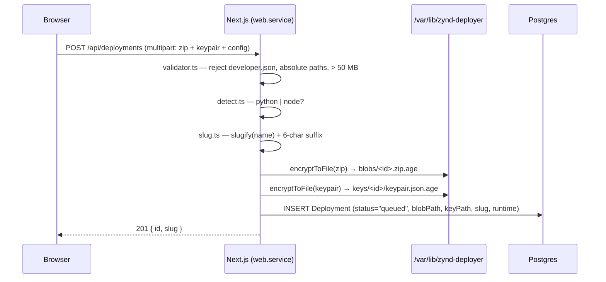
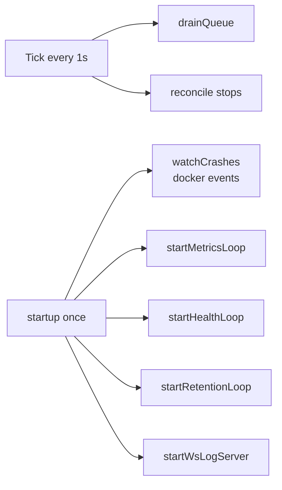

# Architecture

## Two processes, one Postgres

The web service and the worker are independent systemd units that share state only through Postgres and the on-disk data directory:

| Process | Owns | Touches |
|---------|------|---------|
| `zynd-deployer-web.service` | HTTP requests, uploads, dashboard rendering | `Deployment` row inserts, encrypted blob writes, log SSE fan-out from DB |
| `zynd-deployer-worker.service` | Docker, Caddy, port allocation, health, metrics, log tailing, retention GC | `Deployment` row updates, `PortAllocation`, log + metric inserts |

A web restart never disturbs running containers. A worker restart resumes mid-state-machine — the deployment table is the only durable state.

## Upload pipeline



Everything sensitive is encrypted with `age` before it hits disk. The keypair never appears unencrypted on the host outside the worker's tmpfs scratch directory.

## Worker loop

`worker/main.ts` runs three concerns:



`drainQueue` claims the oldest `queued` row by atomically updating `status="starting"`, then hands it to `lifecycle.drive()`. The status update doubles as a lease — two workers running against the same DB will never claim the same row twice.

## Deployment state machine

```
            ┌──────────────────────────────────────────────────────────────┐
            │                                                              │
queued ──► unpacking ──► writing_config ──► allocating_port ──► building   │
                                                                  │        │
                                                                  ▼        │
                                       starting ──► health_checking ──► registering_route
                                                                                     │
                                                                                     ▼
                                                                                  running
                                                                                     │
            ┌────────────────────────────────────────────────────────────────────────┤
            ▼                                                                        │
        unhealthy ◀── 3 consecutive /health failures                                 │
            │                                                                        │
            └─► running (recovers)                                                   │
                                                                                     │
        crashed   ◀── docker events: container died                                  │
        stopped   ◀── user clicked Stop in UI                                        │
        failed    ◀── any pre-running stage threw (validator, port, image, etc.)
```

Each transition is a single `prisma.deployment.update()` followed by a system-log row appended via `appendSystemLog()` — that's how the dashboard timeline stays in sync.

| State | Owner | Notes |
|-------|-------|-------|
| `queued` | web | Inserted by upload handler. |
| `unpacking` | worker | `age -d blobs/<id>.zip.age` → unzip into `workdirs/<id>/`. |
| `writing_config` | worker | `runtime.ts` injects `ZYND_ENTITY_URL`, `ZYND_REGISTRY_URL`, `ZYND_WEBHOOK_PORT` into `.env` and `agent.config.json`. |
| `allocating_port` | worker | `ports.allocate()` — atomic insert into `PortAllocation` for an unused port in `[13000, 14000]`. |
| `building` | worker | runtime-specific — pip install for Python, pnpm install for Node. |
| `starting` | worker | `docker run` with mem/CPU limits, port binding to `127.0.0.1:<port>`. |
| `health_checking` | worker | Poll `http://127.0.0.1:<port>/health` up to 30 times with 1 s spacing. |
| `registering_route` | worker | Caddy admin API call to add `<slug>.deployer.<wildcard>` → `127.0.0.1:<port>`. |
| `running` | worker | Steady state. |
| `unhealthy` | worker | 3 consecutive `/health` failures while `running`. Container untouched — recovers if probes pass again. |
| `crashed` | worker | Captured by `crash.ts` watching `docker events`. `lastExitCode` populated. |
| `stopped` | worker | User clicked Stop. Container, route, port released. |
| `failed` | worker | Any unhandled error before `running`. `errorMessage` captured. |

Failures *after* `running` go to `crashed` or `unhealthy`, never `failed` — `failed` is reserved for never-started.

## Encryption pipeline

`src/lib/crypto.ts` is a thin wrapper around the `age` CLI:

```ts
spawn("age", ["-r", recipient, "-o", outPath], stdin = blob)
spawn("age", ["-d", "-i", AGE_IDENTITY_PATH], stdin = encryptedBytes)
```

- **Master key** — `master.age` generated by `infra/install.sh`, lives at `AGE_IDENTITY_PATH`. Owned by the `zynd` system user, mode `600`.
- **Recipient** — same key (used as the public recipient for encryption). Symmetric in effect.
- **Format** — stock age — interoperable with anything else operators already know.

Why shell out instead of binding a JS library? Operators can verify, decrypt, and rotate blobs with the standard `age` binary they already trust.

## Caddy integration

`worker/caddy.ts` talks to Caddy's admin API at `CADDY_ADMIN_URL` (default `http://127.0.0.1:2019`):

- `ensureServer()` — confirms the wildcard server config exists at startup.
- `addRoute(slug, port)` — POSTs a route block matching `<slug>.deployer.<wildcard>` to a `reverse_proxy 127.0.0.1:<port>`.
- `removeRoute(slug)` — DELETEs the route.

TLS is wildcard via DNS-01 against Cloudflare (`infra/Caddyfile`), so per-tenant slugs need zero per-deployment cert work.

`/api/caddy/ask` handles Caddy's on-demand TLS hook — when a request arrives for a slug Caddy hasn't seen, it asks the deployer "is this slug live?" before issuing a cert.

## Crash detection

`worker/crash.ts` runs once at startup and never returns:

```ts
docker.events({ filters: { event: ["die"] } })
  .on("data", chunk => {
    const evt = JSON.parse(chunk.toString());
    const id = evt.Actor.Attributes.deploymentId;
    markCrashed(id, evt.Actor.Attributes.exitCode);
  });
```

Each container is launched with `--label deploymentId=<cuid>`, so the watcher knows which row to update. Detection is sub-second — much faster than waiting for the next health probe.

## Failure isolation

A crash in the worker doesn't kill running containers (Docker keeps them alive). On worker restart:

1. `drainQueue` resumes any `queued` row.
2. The crash watcher reattaches to `docker events`.
3. Health, metrics, log tailers re-bind to all `running` containers.

This is why we keep the lifecycle state in the DB rather than in-memory.

## Next

- **[Worker Subsystems](/deployer-app/worker)** — every file under `worker/`.
- **[API Routes](/deployer-app/api-routes)** — what the web service exposes.
- **[Data Model](/deployer-app/data-model)** — Prisma schema and at-rest layout.
