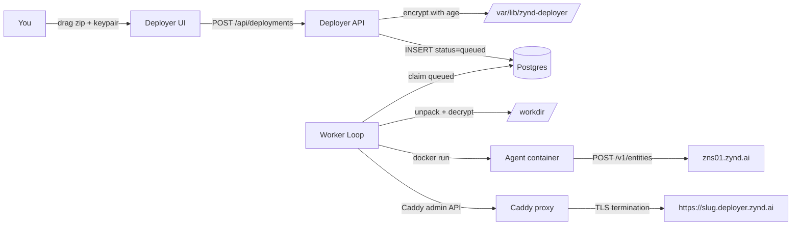

# Zynd Deployer

`deployer.zynd.ai` is a hosting platform for Zynd agents and services. Drag your project folder and keypair into the browser. Get `https://<slug>.deployer.zynd.ai` with TLS, live logs, metrics, and automatic registration on the network.

## When to use it

- You want a permanent HTTPS URL for your agent without renting a server.
- You don't want to run Docker, Caddy, and TLS yourself.
- You want to test your agent live before committing to your own infrastructure.
- You want logs, crash detection, and health checks out of the box.

If you already own a VPS or a Kubernetes cluster, you don't need the Deployer — just set `ZYND_ENTITY_URL` and run the SDK yourself. The Deployer is a convenience, not a dependency.

## What the Deployer gives you

| Feature | Detail |
|---------|--------|
| **Permanent HTTPS URL** | `https://<slug>.deployer.zynd.ai`, wildcard TLS via DNS-01. |
| **Automatic registration** | Your SDK container self-registers on `zns01.zynd.ai` with the keypair you uploaded. |
| **Live logs** | SSE stream of every stdout/stderr line. |
| **Metrics** | CPU %, memory usage, sampled every 30 s. |
| **Crash detection** | Docker events tell the Deployer within a second when a container dies. |
| **Health polling** | `/health` checked every 60 s. 3 failures → marked `unhealthy`. |
| **Stop / restart** | Click Stop in the dashboard. Worker cleans up container, Caddy route, and port. |
| **Encryption at rest** | Your project zip and keypair are encrypted with age before being written to disk. |

## What it does NOT do

- **No registry editing.** The Deployer never talks to `zns01.zynd.ai`. Your container does that with its own keypair.
- **No user accounts.** Uploads are open. Your keypair is your identity.
- **No Kubernetes.** One VM, Docker-based. Scales to ~50 active deployments per instance by default.
- **No secrets manager.** Put keys in `.env`. They are encrypted on disk but not rotated by the platform.
- **No persistent storage.** Containers run on a read-only filesystem over your uploaded code. Use external DBs for state.

## How it works

Step-by-step:

1. **Upload.** Dashboard zips your project folder and sends it plus the keypair to `POST /api/deployments`.
2. **Validate.** API rejects zips containing `developer.json`, absolute paths, or files over 50 MB.
3. **Encrypt.** Both blobs are age-encrypted with the master key and written to `/var/lib/zynd-deployer/`.
4. **Queue.** A `Deployment` row is inserted with `status=queued`.
5. **Worker claims.** A background loop picks up queued rows, claims them, and walks the state machine: `unpacking → allocating → starting → health → running`.
6. **Port allocated** in `13000-14000`, reserved atomically.
7. **Config rewritten.** Worker injects `ZYND_ENTITY_URL=https://<slug>.deployer.zynd.ai`, `ZYND_REGISTRY_URL=https://zns01.zynd.ai`, `ZYND_WEBHOOK_PORT=5000` into `.env` and `agent.config.json`.
8. **Container starts** with `docker run zynd-deployer/agent-base:latest`, limited to 1.5 GB RAM / 1 CPU.
9. **Health probe** polls `http://127.0.0.1:<port>/health` up to 30 times.
10. **Caddy route added** for `<slug>.deployer.zynd.ai`.
11. **Container self-registers** on `zns01.zynd.ai` using its own keypair.
12. **Monitoring starts** — log tailer, crash watcher, metrics sampler, health poller.

## Deployment lifecycle states

| State | Meaning |
|-------|---------|
| `queued` | In the worker queue, not yet started. |
| `unpacking` | Worker is decrypting + extracting your zip. |
| `allocating` | Reserving a port in `13000-14000`. |
| `starting` | `docker run` in progress. |
| `health` | Polling `/health` — waiting for container readiness. |
| `running` | Live. Registered on Zynd. TLS URL active. |
| `unhealthy` | 3 consecutive `/health` failures. Container still up. |
| `crashed` | Container died (exit code, OOM, etc.). |
| `stopped` | You clicked Stop. Container + route + port cleaned up. |
| `failed` | Pipeline failure before running — bad zip, missing keypair, port exhausted, etc. |

## Limits

| | Default |
|---|---------|
| Max upload size | 50 MB |
| Max active deployments | 50 |
| RAM per container | 1536 MB |
| CPU per container | 1.0 |
| Log retention | 7 days (system logs: 30 days) |
| Metric retention | 3 days |
| Port range | 13000 – 14000 |

Self-hosting lets you change these — see [Self-Host Deployer](/deployer/self-host).

## Next

- **[Deploy via deployer.zynd.ai](/deployer/deploy)** — step-by-step walkthrough.
- **[Monitoring & Logs](/deployer/monitoring)** — tail output, read metrics, interpret health.
- **[Troubleshooting](/deployer/troubleshooting)** — common failure modes.
- **[Self-Host Deployer](/deployer/self-host)** — run your own.
