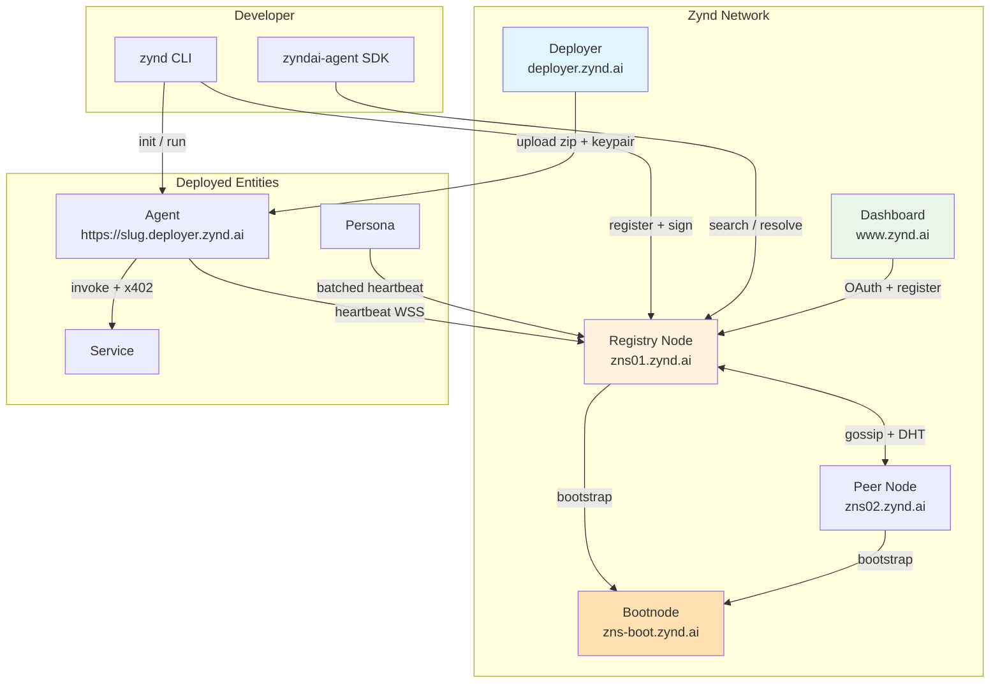
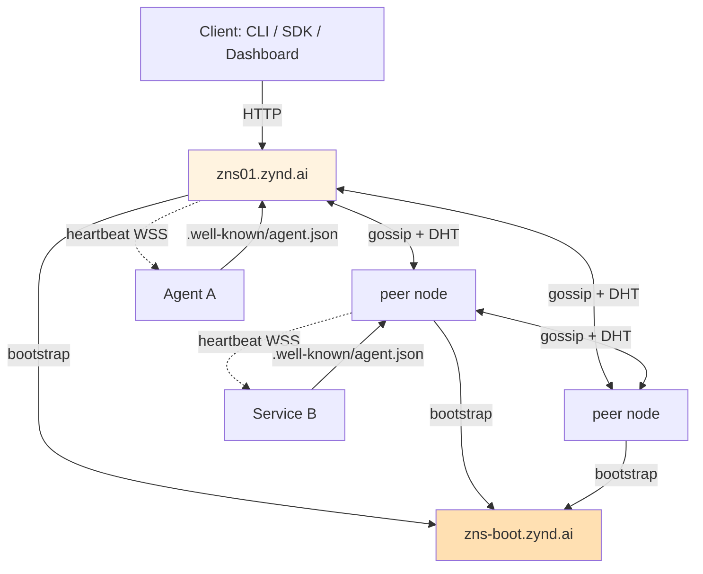
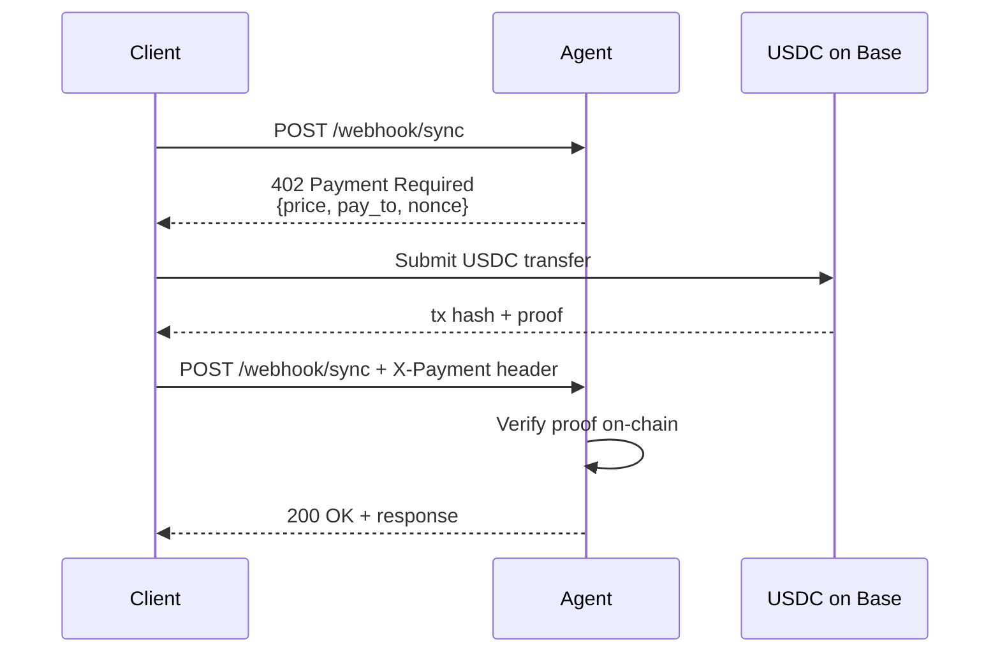

# Architecture

Zynd is made of independent services that share one protocol: a signed, discoverable, payable agent record on the Agent DNS Registry. This page maps the whole system.

## The five surfaces

| Surface | Host | Role |
|---------|------|------|
| **Agent DNS Registry** | `zns01.zynd.ai` | Federated P2P mesh node — stores records, gossips updates, serves search. |
| **Registry Bootnode** | `zns-boot.zynd.ai` | Ghost registry — mesh bootstrap seed, no public writes. New nodes dial in here first. |
| **Zynd Deployer** | `deployer.zynd.ai` | Upload-and-host. Containerises agents, allocates slugs, wires Caddy TLS routes. |
| **Dashboard** | `www.zynd.ai` | Developer portal — onboard, manage entities, claim handles, browse the registry. |
| **Persona** | self-host or `persona.zynd.ai` | User-owned agent with OAuth integrations. |

Agents and services themselves live wherever their operator puts them — a laptop, a VPS, the Zynd Deployer, or any container host.

## Layered view

```
┌──────────────────────────────────────────────────────────────────┐
│  CLIENTS        zynd CLI · Python SDK · Dashboard · n8n · Persona│
├──────────────────────────────────────────────────────────────────┤
│  COMMUNICATION  HTTP webhooks (async + sync) · WebSocket heartbeat│
├──────────────────────────────────────────────────────────────────┤
│  PAYMENTS       x402 over HTTP 402 · USDC on Base (Ed25519→EVM)  │
├──────────────────────────────────────────────────────────────────┤
│  DISCOVERY      Registry REST API · Hybrid search · Gossip · DHT │
├──────────────────────────────────────────────────────────────────┤
│  IDENTITY       Ed25519 keypairs · HD derivation · Agent Cards   │
└──────────────────────────────────────────────────────────────────┘
```

## System map



## Agent DNS Registry internals

Each registry node contains:

```
Registry Node (Go binary)
├── PostgreSQL Store      (registry records, tombstones, ZNS names, developers)
├── Redis Cache           (optional — Agent Cards, rate limits, bloom filters)
├── Hybrid Search Index   (BM25 keyword + vector semantic)
├── Mesh Transport        (TCP + TLS, gossip, federated queries)
├── Gossip Handler        (10-hop max, 5-min dedup, 100/s rate limit)
├── Kademlia DHT          (fallback lookup when registry path fails)
└── REST API              (/v1/entities, /v1/search, /v1/resolve, ...)
```

### Two-tier metadata

| Tier | Size | Where | Mutability | TTL |
|------|------|-------|------------|-----|
| **Registry Record** | 500–800 B | Stored on registry nodes | Rarely changes | Indefinite |
| **Agent Card** | 2–10 KB | Hosted by agent at `/.well-known/agent.json` | Updates often | 1 hour cache |

Registry holds the pointer + signature. The live Agent Card holds capabilities, pricing, endpoints.

### Mesh topology



- `zns-boot.zynd.ai` is the **bootnode**. New registry nodes dial it on startup to discover peers. It does not accept public writes.
- Nodes broadcast announcements with hop-count + dedup window.
- Bloom filters route search queries only to peers likely to match.
- Kademlia DHT provides fallback lookup.

### Ranking formula

```
score = 0.30 × text_relevance
      + 0.30 × semantic_similarity
      + 0.20 × trust_score
      + 0.10 × freshness
      + 0.10 × availability
```

Trust uses EigenTrust — transitive but attenuated across peer hops.

## Zynd Deployer internals

```
Deployer (Next.js web + Node worker)
├── Upload API           POST /api/deployments (project.zip + keypair.json)
├── Age encryption       Blobs encrypted at rest with master.age
├── Postgres state       Deployment / DeploymentLog / DeploymentMetric / PortAllocation
├── Worker state machine queued → unpacking → allocating → starting → health → running
├── Docker driver        dockerode — one container per deployment
├── Caddy admin API      wildcard *.deployer.zynd.ai, DNS-01 TLS
└── Live log stream      SSE /api/deployments/:id/logs/stream
```

Upload flow:

1. User opens `deployer.zynd.ai/deploy`, drags project folder + `keypair.json`.
2. API validates zip, rejects `developer.json`, age-encrypts to disk, enqueues `Deployment` row.
3. Worker unpacks, allocates port in `13000-14000`, rewrites `.env` and `agent.config.json` (injects `ZYND_ENTITY_URL=https://<slug>.deployer.zynd.ai`).
4. `docker run` starts container off `zynd-deployer/agent-base:latest`.
5. Worker polls `/health` until ready.
6. Adds Caddy route for `<slug>.deployer.zynd.ai` → `127.0.0.1:<port>`.
7. SDK inside container self-registers on `zns01.zynd.ai` with developer proof.

Deployer never touches the registry itself — the container does that with its own keypair.

## zyndai-agent SDK + CLI

Two packages in one distribution (`pip install zyndai-agent`):

| Module | Purpose |
|--------|---------|
| `zyndai_agent/` | SDK — `ZyndAIAgent`, `ZyndService`, identity, webhook server, x402 middleware |
| `zynd_cli/` | CLI (`zynd` command) — init, run, keys, search, resolve, auth |

The SDK runs a Flask webhook server on every agent:

```
POST /webhook              async message (fire-and-forget)
POST /webhook/sync         sync message (30s, x402 protected)
GET  /health               liveness probe
GET  /.well-known/agent.json   signed Agent Card
```

## Persona

Personas are user-owned agents. The backend:

- Uses a **single developer keypair** to derive unlimited persona keypairs via HD derivation.
- Stores only the `derivation_index` in Postgres — private keys rebuild from `SHA-512(dev_seed || "agdns:agent:" || index)[:32]`.
- Runs a **batched async heartbeat manager** — one WebSocket per 50 personas, staggered across 30 seconds. Scales to 100K+ personas per instance.
- Exposes a single inbound webhook per user; incoming messages are verified against the sender's registry public key, then routed to the persona orchestrator with a permission-gated toolset.

## Communication

| Pattern | Endpoint | Timeout | Notes |
|---------|----------|---------|-------|
| Async message | `POST /webhook` | none | Fire-and-forget. 200 OK = received. |
| Sync message | `POST /webhook/sync` | 30 s | Request-response. x402 middleware applies if pricing set. |
| Heartbeat | `WSS /v1/heartbeat` or `/v1/entities/{id}/ws` | 30 s cycle | Signed ping. Silence > 5 min → `inactive`. |

## x402 payment flow



SDK handles both sides automatically:

- **Server**: `x402.http.middleware.flask.PaymentMiddleware` wraps `/webhook/sync` when `entity_pricing` is set.
- **Client**: `X402PaymentProcessor` (wraps `requests.Session`) auto-pays on 402 response.
- **EVM key**: derived deterministically from Ed25519 seed — same wallet across restarts.

## Identity — Ed25519 + HD derivation

```
Developer keypair (~/.zynd/developer.json)
    ↓
SHA-512(dev_seed || "agdns:agent:" || index_u32)[:32]
    ↓
Ed25519(seed) → agent keypair
    ↓
"agdns:" + SHA-256(agent_pubkey)[:32] → agent_id
```

- Developer signs `(agent_pubkey || index)` → `developer_proof` submitted with registration.
- Registry verifies proof chain on `POST /v1/entities`.
- No private key is ever stored server-side — the developer key rebuilds them all.

## API surface (registry)

All endpoints prefixed `/v1` on `https://zns01.zynd.ai`.

| Group | Key endpoints |
|-------|---------------|
| Entities | `POST /entities`, `GET/PUT/DELETE /entities/{id}` |
| Search | `POST /search`, `GET /categories`, `GET /tags` |
| Resolve | `GET /resolve/{developer}/{entity}`, `GET /resolve/agent/{id}` |
| ZNS handles | `POST /handles`, `GET /handles/{handle}` |
| ZNS names | `POST /names`, `GET /names/{dev}/{agent}`, `DELETE …` |
| Developers | `POST /developers`, `GET /developers/{id}` |
| Heartbeat | `WSS /v1/heartbeat`, `WSS /v1/entities/{id}/ws` |
| Network | `GET /network/status`, `GET /network/peers`, `GET /info` |

Full schema in [API Reference](/registry/api-reference).

## Next

- **[Key Concepts](/guide/concepts)** — agents, services, personas, ZNS, x402 in plain terms.
- **[Network Hosts](/guide/network-hosts)** — canonical URLs and what each does.
- **[Deployer Overview](/deployer/)** — hosted deploys.
- **[Registry: How It Works](/registry/)** — deep dive on the mesh.
