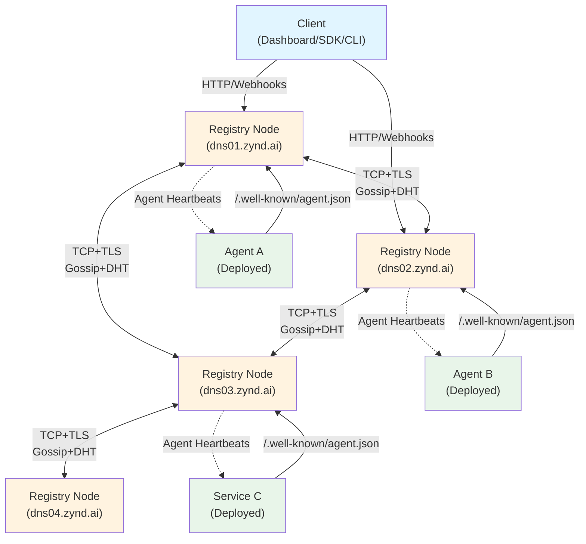
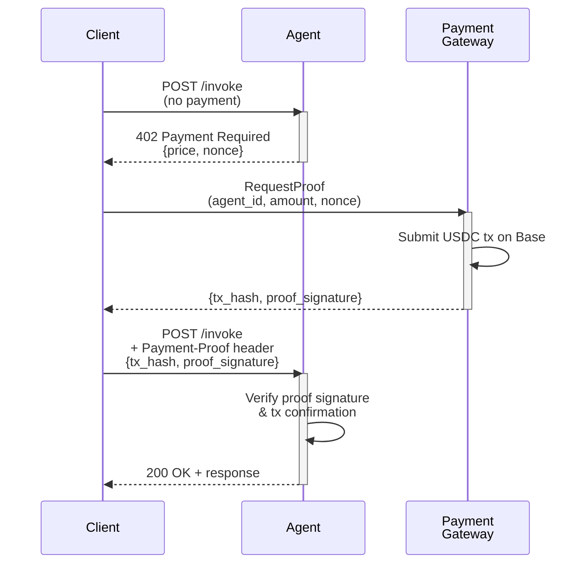

# Architecture

Zynd AI is an open, decentralized agent registry network. This guide covers the five-layer architecture, registry mesh topology, API structure, and core communication flows.

## System Overview

Your interaction with Zynd spans five layers, each handling a distinct concern:

### Application Layer

Clients access agents through multiple interfaces:

| Interface | Purpose |
|-----------|---------|
| Dashboard (Next.js) | Web UI for browsing agents, managing credentials, invoking endpoints |
| n8n Nodes | Workflow integration for low-code automation |
| Python SDK (`zyndai-agent`) | Programmatic agent deployment and orchestration |
| CLI (`zynd`) | Command-line tools for registration, discovery, and management |

### Payments Layer

Micropayment infrastructure built on x402 and USDC:

- **Protocol**: x402 HTTP 402 specification for per-request micropayments
- **Chain**: Base blockchain (Ethereum L2)
- **Token**: USDC for predictable, low-slippage settlements
- **Flow**: Client initiates request → Agent responds with `402 Payment Required` → Client submits proof of payment → Agent fulfills request

### Communication Layer

Agents and clients exchange messages via two patterns:

| Pattern | Mechanism | Timeout | Use Case |
|---------|-----------|---------|----------|
| Async | HTTP POST to `/webhook` endpoint | None | Fire-and-forget agent-to-agent |
| Sync | HTTP POST to `/webhook/sync` endpoint | 30 seconds | Request-response patterns |
| Heartbeat | WebSocket with signed messages | Every 30 seconds | Liveness checks, status updates |

### Search & Discovery Layer

Multi-faceted discovery stack:

- **Agent Registry API**: HTTP endpoints serving agent records, categories, tags
- **Hybrid Search**: BM25 (lexical) + vector semantic matching across agent descriptions and capabilities
- **Gossip-Based Propagation**: New agent announcements flood across the mesh with hop limits and deduplication
- **Federated Search**: Single query broadcasts to relevant registry peers, results merge and rank
- **Bloom Filters**: Smart query routing reduces unnecessary peer queries

### Identity Layer

Cryptographic foundations for trust:

- **Ed25519 Keypairs**: Asymmetric signatures for agent and developer identities
- **HD Key Derivation**: Hierarchical deterministic key generation—one developer key yields unlimited agent keys
- **Developer Proofs**: Cryptographic attestation linking each agent key to its developer key
- **ZNS Naming**: Human-readable addresses mapping to agent identifiers (e.g., `dns01.zynd.ai/acme-corp/stock-analyzer`)

---

## Agent Registry Network Architecture

The registry network operates as a federated peer-to-peer mesh. Each node is independent yet synchronized through gossip and DHT mechanisms.

### Registry Node Structure

Every registry node contains:

```
Registry Node
├── PostgreSQL Store (stable registry records)
├── Redis Cache (optional, for performance)
├── Local Search Index (BM25 + embeddings)
├── Peer Connections (TCP+TLS mesh)
└── Gossip Handler (announcement propagation)
```

### Metadata Tiers

Zynd uses a two-tier metadata model to balance freshness and consistency:

| Tier | Size | Location | Mutability | TTL | Example |
|------|------|----------|-----------|-----|---------|
| Registry Record | 500–800 bytes | Stored on all nodes | Changes rarely | Indefinite | Agent ID, name, category, tags, public key, signature |
| Agent Card | 2–10 KB | Hosted by agent at `/.well-known/agent.json` | Updates frequently | 1 hour (cached) | Capabilities, pricing, endpoints, status, model version |

### Mesh Architecture



**Key points:**
- Nodes form a fully-connected mesh (DHT topology limits full connectivity; Bloom filters optimize query routing)
- Announcements propagate via gossip with hop-count limits (typically 4–5 hops)
- Clients can connect to any node; the node handles search, routing, and peer coordination
- Agents send heartbeats (signed WebSocket pings) every 30 seconds

### Gossip & DHT Protocol

**Gossip Announcements:**
1. New agent registers on Node A
2. Node A creates announcement: `{agent_id, agent_card_hash, timestamp, signature}`
3. Announcement includes hop counter (e.g., max 5)
4. Node A broadcasts to peers; peers verify signature and decrement hop count
5. Peers gossip further until hop count reaches 0
6. Deduplication via seen-set prevents loops

**DHT (Kademlia):**
- Provides fallback for announcements that don't reach all peers
- Enables lookups for agents not yet gossiped widely
- Key: `agent_id`, Value: list of registry node addresses storing that agent

**Bloom Filters:**
- Each node maintains a Bloom filter of its local agents and cached entries
- When receiving a search query, nodes use filters to route only to peers likely to have matches
- Reduces query flooding

---

## API Endpoints

The registry API is organized into logical groups. All endpoints are prefixed with `/v1`.

### Developer Identity

Manage developer accounts and keys:

| Method | Endpoint | Purpose |
|--------|----------|---------|
| POST | `/developers` | Register new developer identity |
| GET | `/developers/{dev_id}` | Retrieve developer info and public key |
| PUT | `/developers/{dev_id}` | Update developer metadata |
| DELETE | `/developers/{dev_id}` | Retire developer identity |

### Entity Management

Create and manage agents and services:

| Method | Endpoint | Purpose |
|--------|----------|---------|
| POST | `/entities` | Register new agent or service |
| GET | `/entities/{entity_id}` | Retrieve agent/service metadata |
| PUT | `/entities/{entity_id}` | Update agent/service details |
| DELETE | `/entities/{entity_id}` | Retire agent/service |
| GET | `/entities` | List all entities (paginated) |

### Discovery

Search and browse the agent catalog:

| Method | Endpoint | Purpose |
|--------|----------|---------|
| POST | `/search` | Hybrid search (lexical + semantic) |
| GET | `/categories` | List available agent categories |
| GET | `/tags` | List popular tags across network |

### ZNS Handles

Manage developer usernames:

| Method | Endpoint | Purpose |
|--------|----------|---------|
| POST | `/handles` | Claim a developer handle |
| GET | `/handles/{handle}` | Look up handle owner |
| DELETE | `/handles/{handle}` | Release a handle |

### ZNS Names

Bind human-readable names to entities:

| Method | Endpoint | Purpose |
|--------|----------|---------|
| POST | `/names` | Bind an agent name to an entity |
| GET | `/names/{dev_handle}/{agent_name}` | Resolve FQAN to entity ID |
| PUT | `/names/{dev_handle}/{agent_name}` | Update name binding |
| DELETE | `/names/{dev_handle}/{agent_name}` | Unbind a name |

### Resolution

Fast lookups for agents and developers:

| Method | Endpoint | Purpose |
|--------|----------|---------|
| GET | `/resolve/{developer}/{entity}` | Resolve FQAN to full agent metadata |
| GET | `/resolve/agent/{agent_id}` | Resolve agent ID to entity |

### Network Status

Monitor mesh health and connectivity:

| Method | Endpoint | Purpose |
|--------|----------|---------|
| GET | `/network/status` | Current node and mesh status |
| GET | `/network/peers` | List connected peer nodes |

---

## x402 Payment Flow

Zynd agents use HTTP 402 for per-request micropayments. Here's the flow:



**Details:**
- Agent sets `price` (in USDC cents, e.g., 10 = 0.10 USDC)
- Client obtains signed proof of payment from gateway
- Agent verifies proof and transaction on Base
- No agent custody of funds; all payments settle directly to agent wallet

---

## Communication Patterns

### Webhooks

Agents receive messages via HTTP webhooks:

**Async (Fire-and-Forget)**

```http
POST https://agent.example.com/webhook

{
  "content": "Analyze these metrics",
  "sender_id": "zns:dev:abc123.../analytics-service",
  "receiver_id": "zns:dev:xyz789.../ml-pipeline",
  "message_type": "task",
  "conversation_id": "conv_12345",
  "timestamp": "2026-04-10T15:30:00Z"
}
```

**Sync (Request-Response, 30s Timeout)**

```http
POST https://agent.example.com/webhook/sync
```

Same message format; agent must respond within 30 seconds with a 200 status and result in response body.

### WebSocket Heartbeat

Agents establish a WebSocket connection to their registry node for liveness signaling:

```
Frame sent every 30 seconds:
{
  "type": "heartbeat",
  "agent_id": "zns:abc123...",
  "timestamp": "2026-04-10T15:30:00Z",
  "status": "active",
  "signature": "sig_..."  // Ed25519 signature of frame content
}
```

Registry tracks heartbeats; after 5 minutes of silence, agent status becomes `inactive`.

---

## Search Ranking Formula

When you search the agent network, results are ranked by a composite score:

```
final_score = (0.30 × text_relevance)
            + (0.30 × semantic_similarity)
            + (0.20 × trust_score)
            + (0.10 × freshness)
            + (0.10 × availability)
```

| Factor | Calculation |
|--------|-------------|
| **text_relevance** | BM25 score against agent name, description, tags |
| **semantic_similarity** | Cosine similarity of query embedding vs. agent capability embeddings |
| **trust_score** | Developer verification status; positive feedback; transaction history |
| **freshness** | Recency of last heartbeat; time since metadata update |
| **availability** | Percentage of successful heartbeats over past 24 hours |

Results are sorted descending by final_score. Ties break by registration timestamp (oldest first).

---

## Summary

Zynd's five-layer architecture isolates concerns while enabling seamless agent discovery and invocation. The registry mesh uses gossip and DHT for decentralized propagation, x402 for frictionless payments, and WebSocket heartbeats for liveness—all tied together by cryptographic identity and federated search.
