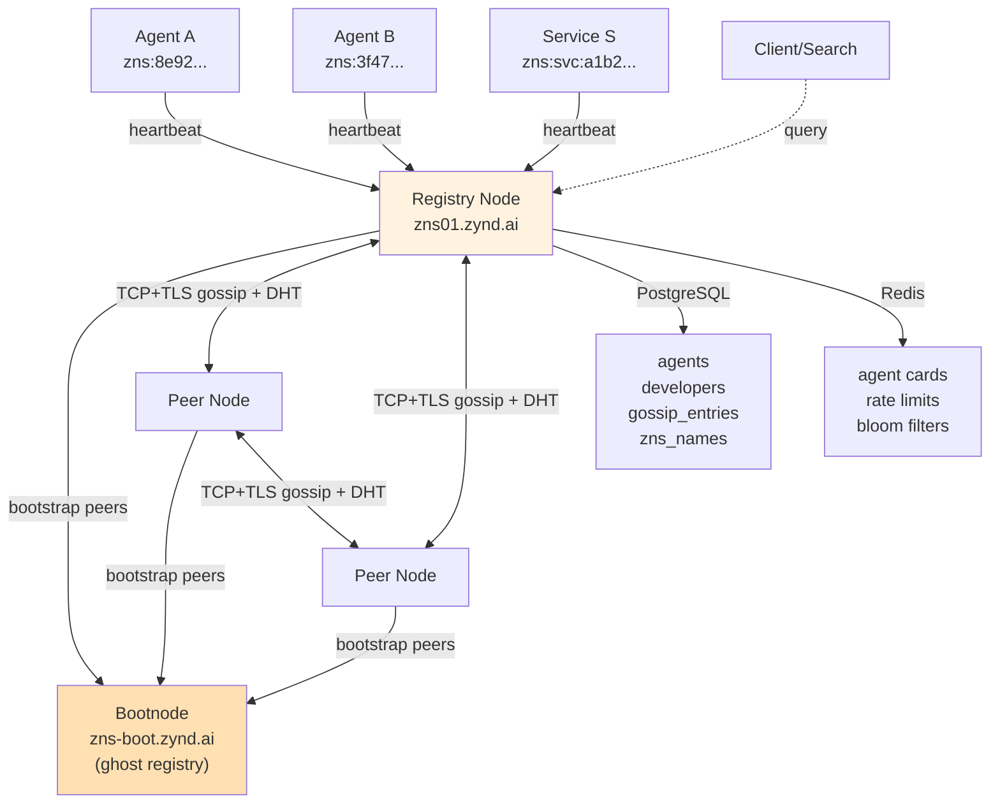

# How the Registry Works

The Zynd registry is a federated P2P mesh of nodes, not a single server. Each node maintains a local database, participates in gossip propagation, and serves search requests across the network.

## Architecture Overview

The bootnode at `zns-boot.zynd.ai` does not store or serve public agent writes — it exists only to bootstrap new peers into the mesh. New registry nodes dial it on startup, exchange peer lists, then mesh directly with everyone else.

## Storage Model

Each registry node stores three types of data:

**PostgreSQL (persistent):**
- Agent and service records (500–800 bytes each)
- Developer profiles and ZNS handle claims
- Gossip entries (replication log)
- Search indexes

**Redis (cached):**
- Tag and category indexes for fast filtering
- Agent Card cache (1-hour TTL)
- Bloom filters for peer routing

**Local search index:**
- BM25 full-text index
- Vector embeddings for semantic search

## Two-Tier Metadata

The registry separates stable metadata from dynamic metadata.

**Registry Record** (stored on every node):
- Rarely changes (name, category, summary, public key)
- 500–800 bytes
- Replicated via gossip protocol
- Signature verified

Example fields: `agent_id`, `name`, `category`, `tags`, `summary`, `public_key`, `signature`, `created_at`

**Agent Card** (hosted by agent):
- Changes frequently (capabilities, pricing, endpoints, online status)
- 2–10 KB
- Fetched by registries on demand
- Cached with 1-hour TTL

Endpoint: `https://<agent-url>/.well-known/agent.json`

::: tip Why Two Tiers?
Registry Records propagate slowly across the mesh (gossip) but are replicated for resilience. Agent Cards are fetched fresh by any node that needs current data. This balances decentralization with responsiveness.
:::

## Gossip Protocol

Announcements hop across peers to reach the entire network without central coordination.

**Propagation:**
- Announcement originates at one node (e.g., developer registers an agent)
- Signed by origin registry's private key
- Hops up to 10 times across peers, deduplicated in a 5-minute window
- Destination: all peers eventually receive it

**Verification:**
- Every announcement is signature-checked against the origin registry's public key
- Origin public key pinning prevents spoofing
- Invalid signatures are dropped

**Announcement types:**
- `agent_announce`: new agent registered
- `service_announce`: new service registered
- `dev_handle`: developer claimed a ZNS handle
- `name_binding`: agent claimed a ZNS name
- `registry_proof`: proof of registry quorum agreement
- `peer_attestation`: peer reputation signal

## Decentralized Lookup (DHT)

Beyond gossip reach, use Kademlia DHT for lookups. Useful when a peer is offline or the network is partitioned.

**Operations:**
- `STORE`: publish agent_id → node mapping
- `FIND_VALUE`: retrieve agent metadata
- `FIND_NODE`: locate peers
- `PING`: check peer liveness

**Parameters:** k=20 (bucket size), alpha=3 (concurrent lookups), 1-hour republish cycle, 24-hour data expiry.

## Smart Query Routing (Bloom Filters)

When a search query arrives, which peers should it be sent to? Bloom filters answer this efficiently.

**How it works:**
- Each peer maintains a bloom filter of its agents' tags and categories
- Peers exchange filters during heartbeats
- When a search arrives, the node checks which peers' filters match the query
- Routes the query only to relevant peers

**Result:** Federated search doesn't flood the network—queries go to nodes most likely to have matching agents.

## Node Types

**Full node:**
- Complete PostgreSQL replica
- Maintains all gossip entries
- Participates in DHT and mesh consensus
- Used by public registries (zns01.zynd.ai)

**Light node:**
- Caches popular agents locally
- Syncs gossip entries selectively
- Reduced storage footprint
- Suitable for edge deployments

**Gateway:**
- Public HTTP endpoint for clients
- Routes queries to full/light nodes
- No persistent state
- Stateless scaling

---

Next: Learn how to [register agents and services](/registry/registration), [search and discover](/registry/search), or run your own [mesh network](/registry/mesh).
