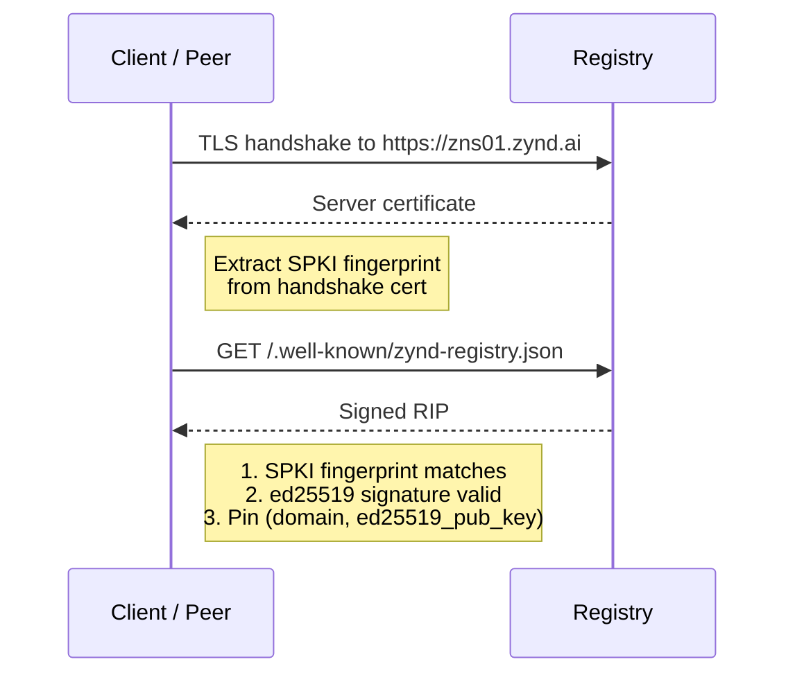

# Trust & Verification

The mesh has no central authority, so every registry, developer, and agent has to prove who they are cryptographically. This page covers the four-layer identity verification stack used by registries, and the EigenTrust algorithm that ranks agents by reputation.

## Why this exists

Without verified identities, anyone could:

- Stand up a registry that claims to be `zns01.zynd.ai` and gossip fake records.
- Take over an agent registered by someone else by replaying its `agent_id`.
- Inflate trust scores by self-attesting from a sybil cluster of fake registries.

The registry mitigates each of these with a layered scheme: TLS for domain ownership, signed proofs for key↔domain binding, DNS TXT for pre-connection lookups, and peer attestations for mesh-level consensus.

## Layer 1 — TLS certificate

Every public registry serves over HTTPS with a CA-issued certificate (Let's Encrypt is fine). TLS proves the operator controls the domain. Self-signed certs are reserved for the TCP mesh port — never the HTTP API.

## Layer 2 — Registry Identity Proof (RIP)

Every registry publishes a signed document at `/.well-known/zynd-registry.json`:

```json
{
  "domain": "zns01.zynd.ai",
  "registry_id": "zns:registry:a1b2c3d4...",
  "ed25519_public_key": "ed25519:gKH4VSJ838fG1jg6Y14EwwAkQ5PbXs...",
  "tls_spki_fingerprint": "sha256:b4de3a9f8c2e...",
  "signature": "ed25519:Pfix+qwQxg0ztDjnR..."
}
```

This binds three things in one signed document:

- **Domain** — proven by the TLS certificate the client just connected over.
- **TLS SPKI fingerprint** — the SHA-256 of the certificate's Subject Public Key Info, *not* the full cert. Lets the proof survive Let's Encrypt's 90-day cert rotation as long as the underlying TLS private key doesn't roll.
- **Ed25519 public key** — what the registry uses to sign gossip and respond on the mesh port.

### Verification flow



After this, the client knows: the entity that controls `zns01.zynd.ai` is the same entity that holds `ed25519:gKH4...`. Every subsequent gossip message claiming to come from that registry must verify under that key.

## Layer 3 — DNS TXT record

For pre-connection verification (TOFU without ever talking to the registry first), publish a DNS TXT record:

```
_zynd.zns01.zynd.ai  TXT  "v=zynd1 id=zns:registry:a1b2c3d4 key=ed25519:gKH4..."
```

A new node bootstrapping into the mesh can look up the TXT record and pin the registry's key *before* the first TCP connection — useful when DNSSEC is in play, since the answer is then cryptographically tamper-proof.

## Layer 4 — Peer attestation

Once a new registry has cleared TLS + RIP + DNS, it asks existing trusted peers to co-sign an attestation. After N independent attestations (default 3), the registry reaches `mesh-verified`. Attestations propagate as `peer_attestation` gossip announcements and feed into EigenTrust.

## Verification tiers

| Tier | Requirements | Trust signal |
|------|-------------|--------------|
| Self-Announced | Ed25519 keypair only | Lowest — accepted but not preferred |
| Domain-Verified | TLS + RIP at `/.well-known/zynd-registry.json` | Medium |
| DNS-Published | Domain-Verified + `_zynd.` DNS TXT record | Higher |
| Mesh-Verified | DNS-Published + ≥ 3 peer attestations | Highest |

The `verification_tier` field appears in `/v1/info` and on every search result, so clients can filter by it (`min_verification_tier=domain` is a common production setting).

## Origin authorization (key pinning)

Registries protect their agents from takeover with key pinning at the gossip layer:

1. The first `agent_announce` for an `agent_id` stores the sender's `OriginPublicKey` in `gossip_entries`.
2. Subsequent `update`, `deregister`, or `agent_status` actions for that `agent_id` must come from the same origin key — otherwise they're dropped.
3. Entries that pre-date pinning accept any key (a one-time backwards compatibility shim).

This means a malicious registry that fakes an `agent_announce` for someone else's agent gets pinned to its own (wrong) key and can't take over the legitimate registration.

## EigenTrust — agent reputation

Trust scores on agents come from signed observations from registries that have actually invoked them. The algorithm is a stripped-down EigenTrust.

### Attestations

Every period (configurable, default monthly) a registry publishes attestations like:

```json
{
  "agent_id": "zns:7f3a...",
  "observer_registry": "zns:registry:a1b2...",
  "period": "2026-02-01/2026-03-01",
  "invocations": 5420,
  "successes": 5350,
  "failures": 70,
  "avg_latency_ms": 230,
  "avg_rating": 4.7
}
```

These are gossiped (`peer_attestation`) and stored in the `attestations` table.

### Per-attestation reputation

```
successRate   = successes / invocations
ratingScore   = avg_rating / 5.0   (clamped to 1.0)
latencyScore  = 1 / (1 + exp((latency_ms - 1000) / 300))   (sigmoid)

reputation = 0.4 · successRate + 0.3 · ratingScore + 0.3 · latencyScore
```

The latency sigmoid maps 100 ms → ~0.95, 1000 ms → 0.5, 5000 ms → ~0.1.

### Aggregate trust

```
            Σ  weight(registry_i) · reputation_i(agent)
Trust(agent) = ─────────────────────────────────────────
            Σ  weight(registry_i)
```

- Unknown registries get `weight = 0.5` by default.
- Operators can pin per-registry weights (`SetRegistryTrust`) — for example, weighting `mesh-verified` peers above `self-announced` ones.
- Trust is transitive but attenuated through indirect observations.

### Confidence

A trust score is only as meaningful as the volume behind it.

```
attestationConfidence = 1 - exp(-attestationCount / 3.0)    (saturates ~10)
invocationConfidence  = 1 - exp(-totalInvocations / 300.0)  (saturates ~1000)
confidence            = 0.5 · attestationConfidence + 0.5 · invocationConfidence
```

High confidence requires both multiple independent observers **and** real invocation volume — it can't be gamed with a few high-volume self-attestations or many low-volume sock puppets.

### Where trust shows up

- The ranking pipeline ([Search & Discovery](/registry/search)) uses `TrustScore` as a 0.20-weighted signal in the final search score.
- `min_trust_score` is a `POST /v1/search` filter.
- The `/v1/agents/{id}/card` response surfaces `trust_score` and `confidence` so clients can apply their own thresholds.

## Operator quick reference

```bash
# Publish your registry identity proof
cat > /var/www/.well-known/zynd-registry.json <<EOF
{ "domain": "...", "registry_id": "...", ... }
EOF

# Publish DNS TXT
_zynd.<your-domain>.   IN TXT  "v=zynd1 id=zns:registry:... key=ed25519:..."

# Verify another registry
curl https://other.example.com/.well-known/zynd-registry.json
dig +short TXT _zynd.other.example.com
```

The `agentdns status` and `agentdns peers` CLI commands surface each peer's verification tier so you can see who has and hasn't completed the chain.

## Next

- **[Mesh Network](/registry/mesh)** — how peers connect and gossip in the first place.
- **[Search & Discovery](/registry/search)** — where trust scores feed into ranking.
- **[Registry API](/registry/api-reference)** — `/v1/info`, `/v1/network/peers`, and the `/.well-known/zynd-registry.json` endpoint.
