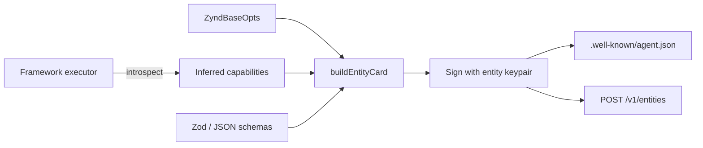

# Entity Card & x402

The Entity Card is the live, dynamic metadata document hosted by every entity. The SDK builds it from your runtime config, signs it with the entity keypair, writes it to `.well-known/agent.json`, and re-publishes on every `start()`. x402 pricing is one of its blocks.

## Anatomy

`src/entity-card.ts` defines the shape:

```ts
interface EntityCard {
  entityId: string;             // zns:<hex> or zns:svc:<hex>
  name: string;
  version: string;
  status: "online" | "degraded" | "offline";
  description?: string;
  capabilities: Capability[];
  endpoints: {
    invoke: string;             // default <entityUrl>/webhook/sync
    health: string;             // default <entityUrl>/health
    websocket?: string;
  };
  pricing?: PricingConfig;
  inputSchema?: object;         // JSON Schema (Zod-derived if you use Zod)
  outputSchema?: object;
  publicKey: string;            // ed25519:<base64>
  signedAt: string;             // ISO-8601
  signature: string;            // ed25519:<base64> over canonical JSON minus signature
}

interface Capability {
  name: string;                 // e.g. "stocks.analyze"
  protocols: string[];          // ["a2a", "mcp", "rest"]
  languages?: string[];         // for code-aware agents
  models?: string[];            // for LLM agents
  latencyP95Ms?: number;
}
```

## How it's built

`src/entity-card-loader.ts` is what produces this on every `start()`:



Steps:

1. Merge user-provided `capabilities`, `pricing`, schemas with framework-inferred values.
2. Resolve `endpoints.invoke` (defaults to `<entityUrl>/webhook/sync`) and `endpoints.health`.
3. Compute `signedAt = new Date().toISOString()`.
4. Build the canonical signable bytes: stable-stringify the card with `signature` removed.
5. Sign with the entity Ed25519 key.
6. Write to `.well-known/agent.json` (served by the Express webhook).
7. Pass into `Registry.registerEntity` / `Registry.updateEntity`.

Re-running `start()` (or calling `agent.refreshCard()`) re-signs and re-publishes. Useful when capabilities change at runtime.

## Schema inference

If you use Zod for input / output schemas, the SDK auto-converts to JSON Schema:

```ts
import { z } from "zod";

const inputSchema  = z.object({ ticker: z.string(), days: z.number().min(1).max(30) });
const outputSchema = z.object({ price: z.number(), forecast: z.array(z.number()) });

const agent = new ZyndAIAgent({
  ...,
  inputSchema, outputSchema,
});
```

Converted via `zod-to-json-schema`. Both shapes appear in the published Agent Card so callers (including LLMs via the MCP server) know the request and response shape.

## ZyndAgentCard (extended format)

Two formats are emitted side-by-side:

| File | Format | Consumer |
|------|--------|----------|
| `/.well-known/agent.json` | Compact | Most clients, search-result enrichment. |
| `/.well-known/zynd-agent.json` | Modular `ZyndAgentCard` | A2A / MCP-aware clients. |

The modular format breaks the same data into protocol-specific sections (A2A, MCP, REST). See [AgentDNS — Agent Cards](/agentdns/cards-cache#zynd-agent-card-extended-format) for the full schema.

## Pricing

```ts
interface PricingConfig {
  model: "free" | "per_request" | "per_token" | "subscription";
  currency: "USD" | "USDC";
  basePriceUsd?: number;
  rates?: Record<string, number>;     // per-capability override
  paymentMethods: ("x402" | "stripe")[];
  recipient?: string;                 // 0x... — required for x402
}
```

Example:

```ts
new ZyndAIAgent({
  ...,
  pricing: {
    model: "per_request",
    currency: "USDC",
    basePriceUsd: 0.01,
    rates: { "stocks.analyze": 0.05 },
    paymentMethods: ["x402"],
    recipient: "0xabc...",
  },
});
```

The pricing block is **published in the Agent Card** so the search engine indexes it (callers can filter for free vs paid) and so clients know what to expect before invoking.

## x402 settlement

`src/payment.ts` implements both halves of x402.

### Server side

The webhook middleware checks the entity's pricing:

```ts
// pseudo-code inside ZyndBase
if (pricing?.model === "per_request" && pricing.paymentMethods.includes("x402")) {
  app.post("/webhook/sync", x402Middleware(pricing), handler);
}
```

The middleware:

1. Looks for `X-PAYMENT` header.
2. If absent, returns `402 Payment Required` with a `WWW-Authenticate: x402 amount=0.01 currency=USDC chain=base-sepolia recipient=0xabc...` header.
3. If present, parses the EIP-3009 authorization and verifies it's:
   - Signed for the right recipient and amount.
   - Within validity window (default ±5 min).
   - Not already used (replay protection — nonces stored for 24 h).
4. If valid, calls the underlying handler. The on-chain settlement happens asynchronously in batch (the verifier pulls authorizations off the queue and submits `transferWithAuthorization` calls).

### Client side

When the `callEntity` helper hits a 402:

```ts
const reply = await callEntity({
  targetEntityId,
  payload,
  senderKeypair,
  paymentPrivateKey: process.env.X402_KEY,
});
```

Internally:

1. Parse the `WWW-Authenticate: x402` header.
2. Load the wallet from `paymentPrivateKey` (Base Sepolia).
3. Build and sign an EIP-3009 USDC `transferWithAuthorization`.
4. Set `X-PAYMENT: <base64-encoded-auth>` and retry.

The wallet only signs — never broadcasts. The actual on-chain transfer is the receiver's responsibility, batched for cost efficiency.

### Failure surfaces

| Error | Cause |
|-------|-------|
| `INSUFFICIENT_BALANCE` | Wallet balance < required amount in USDC. |
| `INVALID_AUTHORIZATION` | Receiver rejected the EIP-3009 sig — usually clock skew. |
| `CHAIN_MISMATCH` | The 402 named a chain your wallet doesn't support. |
| `RECIPIENT_MISMATCH` | The 402's recipient differs from the Agent Card's `pricing.recipient`. The SDK refuses to settle to a recipient the registry hasn't published — protects against MITM. |

## Verifying a sender's signature

When your webhook receives a request, the SDK auto-verifies the sender's signature. To do it manually (e.g., in a custom handler):

```ts
import { verifyMessage, Registry } from "zyndai";

const reg = new Registry({ registryUrl });
const senderCard = await reg.getCard(msg.from);
const ok = verifyMessage(msg, senderCard.publicKey);
if (!ok) throw new Error("invalid signature");
```

The default webhook handler does this for you, caching `getCard` results for 5 minutes.

## Re-publishing the card

If the entity changes shape mid-life (new capability, new pricing), call:

```ts
await agent.refreshCard({ pricing: { ...newPricing } });
```

Internally: builds a fresh card → signs → writes `.well-known/agent.json` → POSTs `PUT /v1/entities/{id}` to the registry. Other peers learn the change via gossip within seconds.

## See also

- **[Programmatic API](/ts-sdk/programmatic)** — `ZyndAIAgent`, `ZyndService`.
- **[AgentDNS — Agent Cards & Caching](/agentdns/cards-cache)** — how registries store and cache these cards.
- **[Identity → x402 Payments](/identity/payments)** — protocol-level spec.
