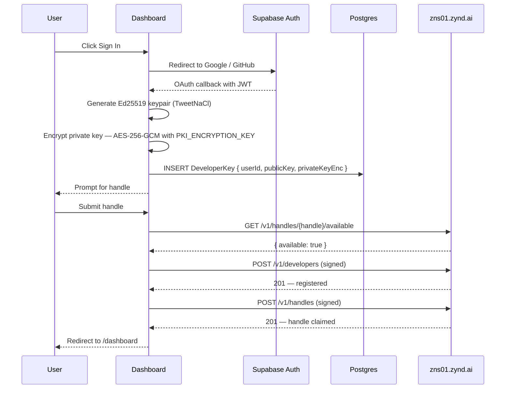

# Dashboard (Implementation)

The dashboard at [zynd.ai](https://www.zynd.ai) is a Next.js 16 app that wraps Supabase Auth, Prisma + Postgres, and the registry's HTTP API into a single GUI for handle claims, entity registration, ZNS bindings, and browsing the network.

If [Get Started → Sign In](../../get-started/sign-in) is the *user flow*, this section is the *implementation* — every route, every internal API, every Prisma model, and how to self-host.

## When to read this

- You're operating a self-hosted dashboard.
- You're contributing to the dashboard repo.
- You're integrating with one of the internal API routes from another app.
- You hit a "where does this come from?" question while clicking around the live dashboard.

## Stack

| Layer | Choice |
|---|---|
| Framework | Next.js 16 (App Router) |
| UI | React 19 + Tailwind |
| Auth | Supabase Auth (Google + GitHub OAuth) |
| Database | PostgreSQL via Prisma + Supabase service role |
| Identity | Ed25519 keypair, AES-256-GCM encrypted at rest |
| Registry client | HTTPS to `zns01.zynd.ai/v1/...` |
| Wallet | viem + wagmi (for x402 / pricing UI) |

## Repository layout

```
dashboard/
├── prisma/
│   ├── schema.prisma            # DeveloperKey, Subscriber, Entity
│   └── migrations/
├── src/
│   ├── app/
│   │   ├── (marketing)          # / , blogs, privacy, terms
│   │   ├── auth/                # Supabase callback, signin
│   │   ├── onboard/             # First-run handle claim
│   │   ├── registry/            # Public agent / service browser
│   │   ├── dashboard/           # Authenticated console
│   │   │   ├── entities/        # List, create, edit
│   │   │   ├── names/           # ZNS bindings
│   │   │   ├── settings/        # Keys, account
│   │   │   └── admin/           # Admin-only
│   │   ├── api/                 # Next.js route handlers
│   │   │   ├── developer/       # register, keys, username-check
│   │   │   ├── entities/        # sync, [id]
│   │   │   ├── zns/             # names, resolve
│   │   │   ├── registry/        # categories, entities, network, search
│   │   │   ├── onboard/         # approve
│   │   │   ├── admin/           # users
│   │   │   └── subscribe/       # newsletter
│   │   ├── layout.tsx
│   │   └── page.tsx             # Marketing landing
│   ├── components/
│   ├── hooks/
│   │   ├── useAuth.ts
│   │   └── useEntities.tsx
│   ├── lib/
│   │   ├── api/                 # Registry HTTP client
│   │   ├── supabase/            # Server + browser helpers
│   │   ├── prisma.ts
│   │   ├── pki.ts               # AES-256-GCM key encryption
│   │   ├── abi.ts               # Wallet ABIs
│   │   └── constants.ts
│   ├── store/
│   │   └── global.store.ts      # Zustand
│   └── middleware.ts            # Supabase auth refresh
└── package.json
```

## Identity flow on first sign-in



The private key never leaves the server unencrypted. AES-256-GCM is in `lib/pki.ts`; the master key is `PKI_ENCRYPTION_KEY` in the env. Anyone reading the database alone cannot recover any private key.

## Prisma schema

```
DeveloperKey
  ├── id (cuid)
  ├── userId (Supabase user id, unique)
  ├── publicKey (string)
  ├── privateKeyEnc (string — AES-256-GCM ciphertext + IV + tag, all base64)
  └── createdAt

Entity
  ├── id (cuid)
  ├── userId
  ├── entityId (zns:... — registry-issued)
  ├── name
  ├── type ('agent' | 'service')
  ├── category, tags, description, version
  ├── pricing (json)
  ├── entityUrl
  ├── lastSyncedAt
  └── createdAt, updatedAt

Subscriber
  ├── id, email, createdAt
```

The dashboard's Postgres is **its own** — separate from the registry's Postgres. Entities are mirrored locally for fast UI rendering; the registry is the source of truth and the dashboard syncs periodically and on demand.

## Internal API routes

Every route handler lives under `src/app/api/...` and runs as a Next.js Edge or Node function.

| Route | Method | Purpose |
|---|---|---|
| `/api/developer/register` | POST | First-run dev registration with the registry |
| `/api/developer/keys` | GET | Decrypt + return the user's private key (only for the active session) |
| `/api/developer/username-check` | GET | Proxy to `/v1/handles/{handle}/available` |
| `/api/entities/sync` | POST | Re-sync the user's entities from the registry into Prisma |
| `/api/entities/[id]` | GET / PUT / DELETE | CRUD against the registry, mirrored locally |
| `/api/zns/names` | POST | Bind a ZNS name |
| `/api/zns/resolve` | GET | Resolve a FQAN |
| `/api/registry/search` | POST | Server-side proxy to `/v1/search` so credentials stay server-side |
| `/api/registry/categories` | GET | Cached `/v1/categories` |
| `/api/registry/network` | GET | Cached `/v1/network/status` |
| `/api/onboard/approve` | POST | Used in restricted-mode registries |
| `/api/admin/users` | GET | Admin-only user list |
| `/api/subscribe` | POST | Newsletter subscribe |

## Auth middleware

`src/middleware.ts` runs on every request. It:

1. Refreshes the Supabase session if expired.
2. Attaches the user's id to the request (via the `cookies()` helper).
3. Redirects to `/auth/signin` for routes under `/dashboard/*`.

Supabase's client lives in `lib/supabase/server.ts` (server-side only — has the service role) and `lib/supabase/browser.ts` (anon key, used in client components).

## Registry client

`lib/api/registry.ts` is a typed wrapper over `fetch` that:

- Sets `Content-Type: application/json` and parses responses.
- Adds the registry's URL from `process.env.ZYND_REGISTRY_URL` (default `https://zns01.zynd.ai`).
- Signs requests when given a keypair — used for entity creation / updates / deletes.
- Surfaces a typed error class (`RegistryError`) with code + field.

The dashboard never sends user keypairs over the wire; the encrypted-on-disk private key is decrypted server-side in `pki.ts`, used to sign the request, then immediately discarded.

## Self-host

| Step | What it does |
|---|---|
| Provision a Postgres database | Either Supabase (recommended — gets you Auth + DB) or a separate Postgres |
| Configure Supabase project | Create OAuth providers (Google + GitHub), set redirect URLs |
| Set env vars | `DATABASE_URL`, `SUPABASE_URL`, `SUPABASE_ANON_KEY`, `SUPABASE_SERVICE_ROLE_KEY`, `PKI_ENCRYPTION_KEY` (32-byte base64), `ZYND_REGISTRY_URL` |
| Run migrations | `npx prisma migrate deploy` |
| Build & deploy | `npm run build && npm start` (or behind Vercel / Fly / your own) |
| Optional: Webflow theming | Replace the marketing components with your own |

| Env var | Purpose |
|---|---|
| `DATABASE_URL` | Postgres |
| `SUPABASE_URL`, `SUPABASE_ANON_KEY`, `SUPABASE_SERVICE_ROLE_KEY` | Auth |
| `PKI_ENCRYPTION_KEY` | AES-256 master for `DeveloperKey.privateKeyEnc`. **Rotate carefully — re-encrypt all rows on rotate.** |
| `ZYND_REGISTRY_URL` | Default registry the UI talks to |
| `NEXT_PUBLIC_SUPABASE_URL` | Browser-side Supabase URL |
| `NEXT_PUBLIC_SUPABASE_ANON_KEY` | Browser-side anon key |
| `ADMIN_USER_IDS` | Comma-separated Supabase user IDs allowed into `/dashboard/admin` |

## See also

- **[Get Started → Sign In](../../get-started/sign-in)** — user-facing walkthrough.
- **[Architecture: AgentDNS](../agentdns/)** — what runs on the other end of every `/v1/...` call.
- **[Identity & Cryptography](../../reference/identity)** — the Ed25519 layer the dashboard wraps.
