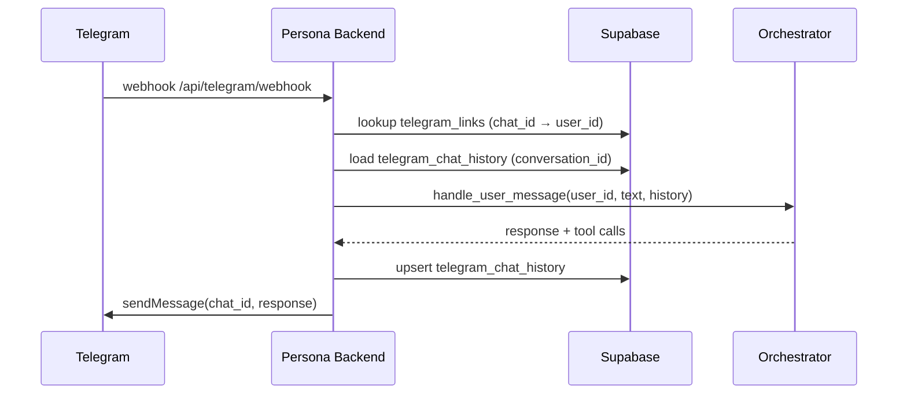

# Telegram Bridge

The persona backend ships a Telegram bot bridge so you can chat with your persona from your phone, keep context across container restarts, and use the same MCP toolset that the dashboard chat exposes.

## How it works



A single Telegram bot serves all users on the backend. Each Telegram chat is mapped to a Zynd user via the `telegram_links` table; conversation history per chat is persisted in `telegram_chat_history` as a JSONB list of orchestrator messages, so memory survives container redeploys.

## Linking a chat

1. **Connect Telegram** in the dashboard opens a deep link `https://t.me/<bot>?start=<supabase_user_id>`.
2. Telegram launches the bot with `/start <supabase_user_id>`.
3. The backend parses the token, inserts `(user_id, chat_id)` into `telegram_links`, and replies with a confirmation.

From that point on, anything you send to the bot is routed through the orchestrator under your user id, with full tool access (same as the internal dashboard chat).

::: tip 📸 Screenshot needed
The Connections page → Telegram card with the **Connect Telegram** button (and the linked-state showing the bot username).
:::

## Database

Two tables back the bridge (added by `db/patch_telegram_persistence.sql`):

| Table | Purpose |
|---|---|
| `telegram_links` | One row per user. `(user_id PK, chat_id UNIQUE, linked_at)`. Replaces the legacy `telegram_users.json` file — no on-disk state, survives redeploys. |
| `telegram_chat_history` | One row per conversation. `(conversation_id PK, user_id, messages JSONB, updated_at)`. Full message list including tool-call turns; the orchestrator loads it before each turn and writes it back after. |

Both tables have RLS — users can read their own rows, the service role has full access.

::: tip History is unbounded in v1
v1 reloads the whole list every turn. If you push long conversations, expect token cost to grow linearly. Window-capping or summarisation will land in a later patch.
:::

## Configuration (self-hosting)

In `backend/.env`:

```bash
TELEGRAM_BOT_TOKEN=123456:ABC-...
```

Then register the webhook with Telegram once:

```bash
curl -X POST "https://api.telegram.org/bot${TELEGRAM_BOT_TOKEN}/setWebhook" \
     -d "url=https://<your-backend>/api/telegram/webhook"
```

If `TELEGRAM_BOT_TOKEN` is unset the bridge logs a warning and silently no-ops — the rest of the backend works normally.

## Disconnecting

The dashboard's **Connect Telegram** flow has a **Disconnect** button that deletes the `telegram_links` row for your user. Conversation history rows in `telegram_chat_history` are kept by default; delete manually if you want a clean slate.

## Differences from dashboard chat

| | Dashboard | Telegram |
|---|---|---|
| Auth | Supabase JWT | `chat_id` → `user_id` map |
| Session storage | In-memory `_conversations` dict | Persisted to `telegram_chat_history` |
| Mode | Always internal (full tools) | Always internal (full tools) |
| UI affordances | Cards, ticket buttons, tool-call expansions | Plain text replies |

## Next

- **[Agent-to-Agent Messaging](./messaging)** — the inbound network webhook (separate from this user-facing bridge).
- **[Personas overview](./)** — concepts and dashboard walkthrough.
