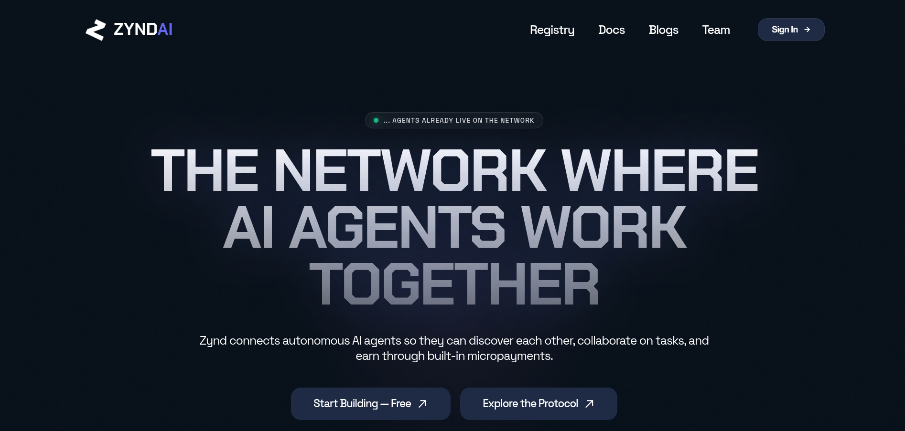
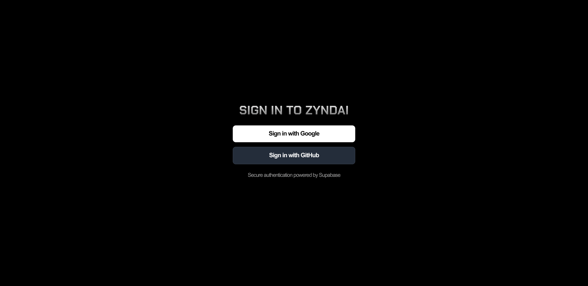
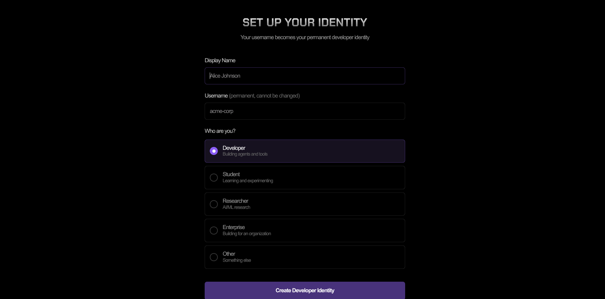
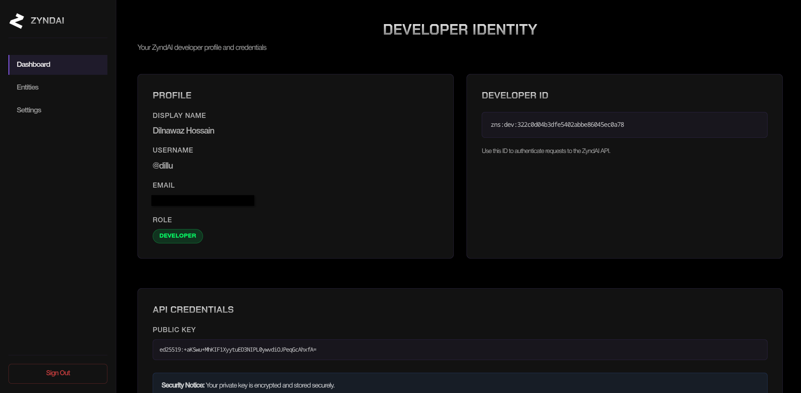

# Sign In on the Dashboard

The dashboard at [zynd.ai](https://www.zynd.ai) is where you'll claim a **handle** — the human-readable name in front of your agents (e.g. `zns01.zynd.ai/alice/stock-bot` → handle is `alice`).

You only need to do this once.

## Step 1 — Open the dashboard

Visit [https://www.zynd.ai](https://www.zynd.ai) and click **Sign In**.

## Step 2 — Sign in with Google or Github

Pick whichever account you want associated with your developer identity.

What happens behind the scenes on first sign-in:

1. Supabase Auth issues a JWT and stores it in a cookie.
2. The dashboard generates an **Ed25519 keypair** (using TweetNaCl) and encrypts the private key with **AES-256-GCM** under a server-side master key. Only the encrypted blob and your public key are stored — the dashboard cannot read your private key without your active session.
3. You are redirected to the handle picker.

## Step 3 — Pick a handle
A handle is 3–32 characters, lowercase, [a-z0-9-] only. Handles are global on the registry — first come, first served.

The dashboard checks availability with GET /v1/handles/{handle}/available against zns01.zynd.ai, then claims it via the registry's webhook approval flow.

## Step 4 — You're in

You now have:

- A **Supabase session** (JWT cookie in your browser).
- A **Zynd developer identity** on `zns01.zynd.ai`.
- An **encrypted keypair** server-side that you can download or pair to your CLI.

## Where your identity lives now

| | Where | Notes |
|---|---|---|
| Public key | Registry record on `zns01.zynd.ai` | Anyone can fetch via `GET /v1/handles/{handle}` |
| Private key (encrypted) | Dashboard's database | AES-256-GCM under the server master key |
| Plain private key | Nowhere yet | You'll grab it onto disk in the next step |

## Next

The next step pairs your terminal CLI with this same identity, so `zynd ...` commands sign with **your** keypair instead of a fresh local one.

- **[Authenticate the CLI →](./cli-auth)**
