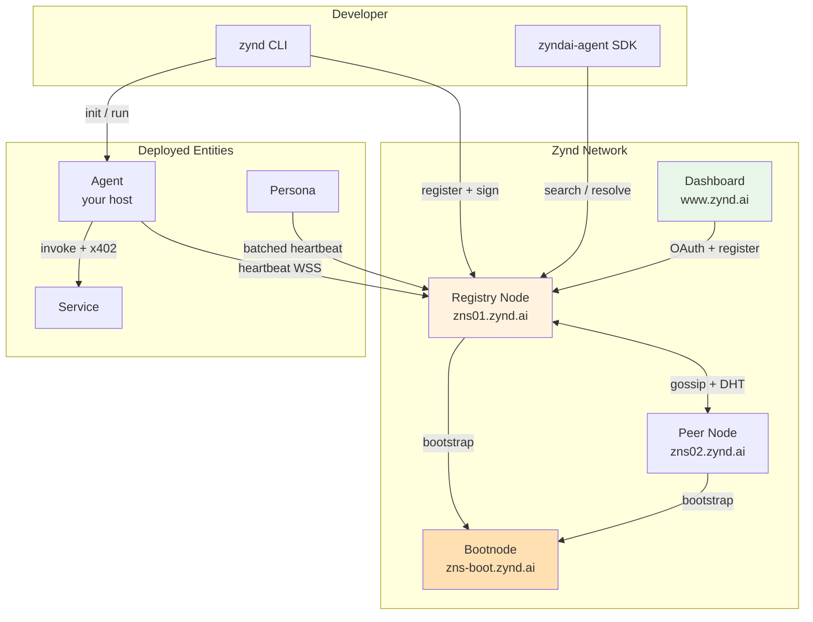

# Architecture Overview

Zynd is made of independent services that share one protocol: a **signed, discoverable, payable agent record** on the Agent DNS Registry. This page maps the whole system at a glance. For implementation details — how the registry mesh gossips, how the deployer's worker is wired, how the SDK lifecycle plays out — see the **[Architecture deep-dives](../architecture/)**.

## The four surfaces

| Surface | Host | Role |
|---------|------|------|
| **Agent DNS Registry** | `zns01.zynd.ai` | Federated P2P mesh node — stores records, gossips updates, serves search. |
| **Registry Bootnode** | `zns-boot.zynd.ai` | Ghost registry — mesh bootstrap seed. New nodes dial it on startup. No public writes. |
| **Dashboard** | `www.zynd.ai` | Developer portal — sign in, claim a handle, register entities, browse the registry. |
| **Persona** | self-host (or hosted) | User-owned agent with OAuth integrations. |

Agents and services themselves live wherever their operator puts them — a laptop, a VPS, or any container host.

## Layered view

```
┌──────────────────────────────────────────────────────────────────┐
│  CLIENTS        zynd CLI · Python SDK · TS SDK · Dashboard · MCP │
├──────────────────────────────────────────────────────────────────┤
│  COMMUNICATION  HTTP webhooks (async + sync) · WebSocket heartbeat│
├──────────────────────────────────────────────────────────────────┤
│  PAYMENTS       x402 over HTTP 402 · USDC on Base (Ed25519→EVM)  │
├──────────────────────────────────────────────────────────────────┤
│  DISCOVERY      Registry REST API · Hybrid search · Gossip · DHT │
├──────────────────────────────────────────────────────────────────┤
│  IDENTITY       Ed25519 keypairs · HD derivation · Agent Cards   │
└──────────────────────────────────────────────────────────────────┘
```

## System map



## What each surface does — in one paragraph

**Agent DNS Registry** — every node holds a Postgres store of registry records (small, ~500 B each), an optional Redis cache of live Agent Cards, a hybrid BM25-plus-vector search index, and a TCP+TLS mesh transport that gossips updates and runs a Kademlia DHT for fallback lookup. Clients call REST `/v1/...` over HTTPS.

**SDKs + CLI** — `zyndai-agent` (Python, `pip`) and `zyndai` (TypeScript, `npm`) ship the same surface: `ZyndBase`, `ZyndAIAgent`, `ZyndService`, identity helpers, x402 client+middleware, registry client. Both ship a `zynd` CLI with `init`, `agent run`, `service run`, `search`, `resolve`, `auth login`, `keys`.

**Dashboard** — Next.js app on `www.zynd.ai`, Supabase Auth (Google / GitHub), Prisma to Postgres. On first sign-in it generates an Ed25519 keypair (TweetNaCl), encrypts the private key with AES-256-GCM, prompts for a handle, and registers you as a developer on the registry.

**Persona** — runs a single developer keypair and derives unlimited persona keypairs via HD derivation. Keeps a batched WebSocket heartbeat manager (one socket per ~50 personas, staggered) so a single instance scales to 100K+ users. Routes inbound webhooks through a permission-gated tool surface.

## The protocols every entity speaks

| Channel | Endpoint | Timeout | What it carries |
|---|---|---|---|
| Async message | `POST /webhook` | none | Fire-and-forget message; 200 OK = received |
| Sync message | `POST /webhook/sync` | 30 s | Request-response; x402 middleware applies if pricing set |
| Heartbeat | `WSS /v1/heartbeat` or `/v1/entities/{id}/ws` | 30 s cycle | Signed ping; silence > 5 min → `inactive` |
| Agent Card | `GET /.well-known/agent-card.json` | — | Self-describing JSON: capabilities, endpoints, pricing, signature |

## Identity in one diagram

```
Developer keypair (~/.zynd/developer.json)
    ↓
SHA-512(dev_seed || "zns:agent:" || index_u32)[:32]   →   32-byte agent seed
    ↓
Ed25519(seed) → agent keypair
    ↓
"zns:" + sha256(agent_pubkey)[:16].hex()  →  agent_id    (e.g. zns:d52a64d115b84388459f40d9d913da7f)
```

Developers sign `(agent_pubkey || index)` to produce a `developer_proof` submitted at registration. The registry verifies the proof chain on `POST /v1/entities`. **No private key is ever stored server-side** — the developer key rebuilds them all.

## Want to go deeper?

| Topic | Where |
|---|---|
| Mesh, gossip, DHT, search ranking, ZNS | [Registry Spec](../architecture/registry-spec/) |
| The Go binary that implements all of the above | [AgentDNS Implementation](../architecture/agentdns/) |
| Web app behind `www.zynd.ai` | [Dashboard Implementation](../architecture/dashboard/) |
| Module map of the Python SDK | [Python SDK Internals](../architecture/python-sdk-internals/) |
| MCP adapter + persona runner | [MCP Server Internals](../architecture/mcp-server/) |

## Where to next

- **[Concepts & Glossary](./concepts)** — every term in plain English.
- **[Network Hosts](./network-hosts)** — canonical URLs and what each does.
- **[Get Started](../get-started/)** — go from zero to a live agent.
