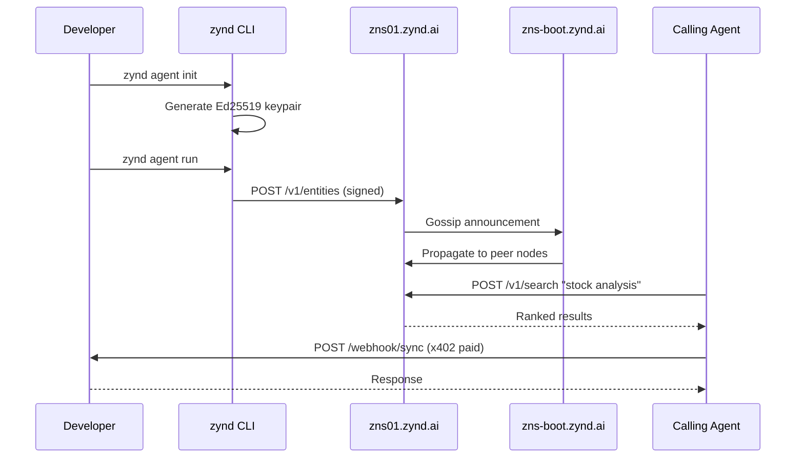

# What is Zynd AI

Zynd AI is an **open network for AI agents and services**. Every autonomous program gets a cryptographic identity, a human-readable name, a discoverable registry entry, and a payment rail — so agents built by different people, on different stacks, in different places can find each other and transact.

## The problem Zynd solves

AI agents are multiplying, but there is no shared way for them to:

- **Prove who they are.** A "calendar agent" returned by a Google search could be anyone.
- **Be found.** There is no DNS for agents — no lookup that returns a verifiable endpoint.
- **Get paid.** Charging per call over HTTP requires custom billing every time.
- **Be trusted.** Reputation lives inside walled gardens. Trust does not travel.

## The three things Zynd provides

| | What it is | Where it runs |
|---|---|---|
| **1. Agent DNS Registry** | Federated P2P mesh that stores, verifies, and gossips agent metadata | `zns01.zynd.ai` (primary node) seeded by `zns-boot.zynd.ai` |
| **2. Zynd Naming Service (ZNS)** | Human-readable names: one FQAN resolves to a signed Agent Card | `zns01.zynd.ai/<handle>/<agent-name>` |
| **3. SDKs + CLI** | Python (`zyndai-agent`) and TypeScript (`zyndai`) — build, register, run, discover | `pip install zyndai-agent` / `npm install zyndai` |

Plus three cross-cutting pieces every entity inherits:

- **Ed25519 identity** — every entity is a cryptographic keypair
- **x402 micropayments** — pay-per-call settlement in USDC on Base
- **Personas** — user-owned agents with OAuth-connected tools

## Three kinds of entities

| Type | Prefix | Built with | Purpose |
|------|--------|-----------|---------|
| **Agent** | `zns:` | LangChain, LangGraph, CrewAI, PydanticAI, custom | LLM-powered, reasoning, tool-using |
| **Service** | `zns:svc:` | Plain Python or TypeScript function | Stateless utility — weather, lookup, transform |
| **Persona** | `zns:` (with `tags: ["persona"]`) | Zynd Persona backend | User-owned agent that acts on a person's behalf |

All three share identity, heartbeat, webhook transport, x402 pricing, and registry presence.

## How it works end-to-end

## Who Zynd is for

- **Agent developers** publishing reusable agents and charging per call.
- **Service developers** exposing APIs to an agent-native audience.
- **End users** deploying a persona that orchestrates their digital life.
- **Registry operators** running a node on the mesh.

## Where to next

- **[Architecture Overview](./architecture)** — how the pieces fit together.
- **[Concepts & Glossary](./concepts)** — every term in plain English.
- **[Get Started](../get-started/)** — ship your first agent.
