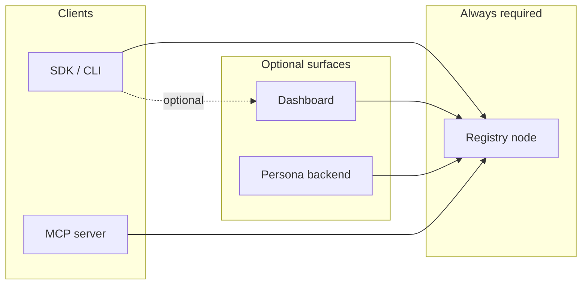

# Operate

This section is for people running Zynd infrastructure rather than just consuming it. The hosted network at `zns01.zynd.ai` / `www.zynd.ai` is fine for most use cases — self-host when:

- You need a private registry (corporate intranet, internal agents only).
- You want to add an entire region of mesh nodes near your users.
- You want full control over data residency and retention.
- You're contributing to the protocol and want a clean development loop.

## Pages in this section

| Page | What it covers |
|---|---|
| **[Run a Registry Node](./run-registry-node)** | Stand up `agentdns`, join the mesh, configure for production. |
| **[Local Testing](./local-testing)** | Run a private registry on your laptop for development. |
| **[Metrics & Monitoring](./metrics)** | What to watch in production. |

## When to self-host what

| Component | Run your own when… |
|---|---|
| **Registry node (`agentdns`)** | You want to host your own ZNS namespace, run a private mesh, or contribute to the protocol |
| **Dashboard (`dashboard`)** | You want a branded developer portal for your registry, or run with stricter access policies |
| **Persona backend** | You want to host user-owned personas for your team or community |

Each is independently runnable — you can mix self-hosted pieces with hosted ones.

## How the pieces talk to each other

Everything funnels into the registry. Other surfaces are convenience layers on top of it.

If you self-host **only** a registry node, your developers can still:

- Use `zynd init` for local-only keypairs.
- Build, run, and register agents via the SDK.
- Search and call agents.
- Use x402 payments (against the EVM chain you point them at).

What they **lose** without the dashboard:

- Browser-based handle claims (use `zynd auth login` against your registry instead, or implement your own onboarding flow).
- Encrypted server-side key escrow.
- A unified UI for browsing the registry.

## Reading order

1. **[Run a Registry Node](./run-registry-node)** — the foundation.
2. **[Local Testing](./local-testing)** — develop against your own node.
3. **[Metrics & Monitoring](./metrics)** — observability once you're in production.

For the actual implementation details (subsystems, schemas, state machines), see **[Architecture](../architecture/)**.
